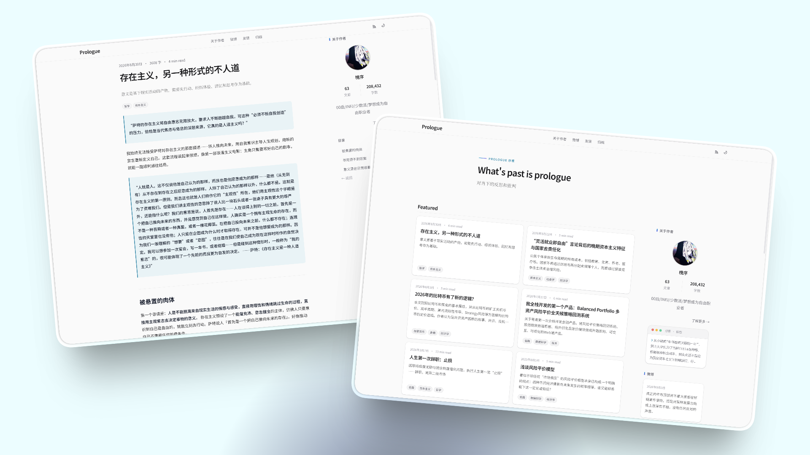
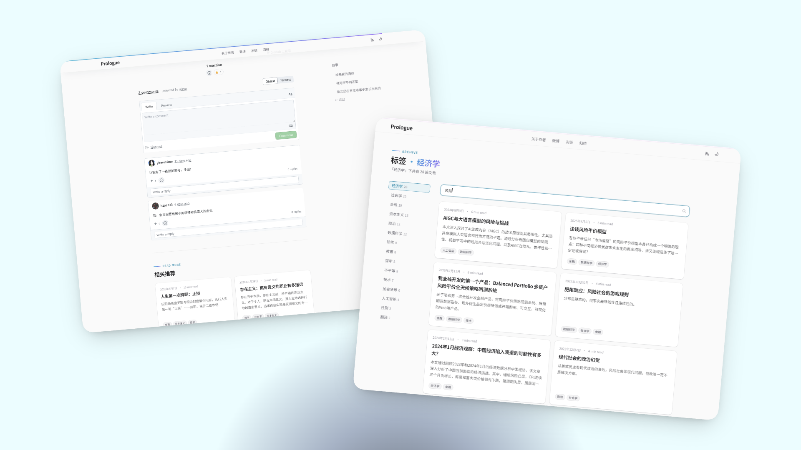

# Prologue Blog

Next.js 16 + Tailwindcss v4 + Contentlayer2 + Markdown/MDX Blog

A content-first blog starter built with Next.js 16, Contentlayer2, and Markdown.

**一个面向内容创作者与开发者的现代博客模板：支持 Markdown/MDX、公式、Mermaid、Feed、SEO、搜索与暗黑模式，并保持简单的配置驱动体验。**


## Features

- Content Focused, Contentlayer + MD/MDX
- Adaptive dark mode
- Full SEO, Opengraph + JSON-LD + RSS
- Lightweight search engine, powered by Fuse.js

- 专注于内容创作，支持 markdown/mdx
- 自适应黑暗模式
- 完整的 SEO 支持，支持 Opengraph、JSON-LD 和 RSS
- 轻量级的搜索引擎，Fuse.js 实现全文搜索和模糊搜索
- 支持 mermaid 渲染

博客链接：https://prologue.dev

## Previews



首页与文章页



文章搜索与评论功能


手机端首页、个人页、友链页


## Get Started

想直接搭自己的博客？请使用独立Demo模板仓库（最小版本，不含作者历史文章）：

**[hxlog/prologue-blog-template](https://github.com/hxlog/prologue-blog-template)**（GitHub Template）

[](https://vercel.com/new/clone?repository-url=https%3A%2F%2Fgithub.com%2Fhxlog%2Fprologue-blog-template)

```bash
git clone https://github.com/hxlog/prologue-blog-template.git my-blog
cd my-blog
npm install
npm run dev
```

You can easily customize the template site: all configurations are in `/data`, static files are in `/public`.

你可以很容易自定义网站，所有配置文件都在 `/data` 目录，静态文件存放在 `/public`。

博客文章和页面的Markdown静态文件分别存放在`/data/content/blog`和`/data/content/pages`。

博客的基本元数据、友链、微博、tag标签关联存放在`sitemetadata.js`, `links.yaml`, `microblog.yaml`, `taglabel.js`


## Configuration

Post Frontmatter

```yaml
---
title: title
description: description
publishDate: 2022-11-13
(required)

lastmod: 2023-07-02
featured: true
tags: ["tag1","tag2"]
image: /static/photos/06.jpg
imageDesc: This is a static file
(optional)
---
```

Page Frontmatter

```yaml
title: title
description: description
(required)
```
