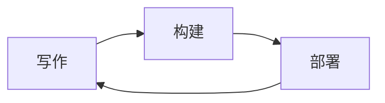

# Prologue Content Platform Implementation Plan

> **For agentic workers:** REQUIRED SUB-SKILL: Use superpowers:subagent-driven-development (recommended) or superpowers:executing-plans to implement this plan task-by-task. Steps use checkbox (`- [ ]`) syntax for tracking.

**Goal:** Replace Contentlayer2 with a Turbopack-native in-repo content layer, make one Obsidian vault cover every static asset the site serves, render markdown at least as well as today, and ship a bilingual demo template.

**Architecture:** A server-only `src/lib/content/` module reads `data/content/**` with `fs` and runs the *same* unified pipeline Contentlayer2 configures today. It is memoized and lazy: frontmatter/`readingTime`/`headings` are eager and cheap, `body.html` (which needs Shiki) is computed on demand. Images and every other static asset move under `data/static/`, which Next serves as real static files (via a directory link at `public/static`) and Obsidian reaches directly, so a single vault covers all of it.

**Tech Stack:** Next.js 16.3.4 (App Router, Turbopack), React 19, Tailwind CSS v4, unified/remark/rehype, Shiki, Obsidian.

## Global Constraints

- Node 24 — this repo builds on `v24.16.0`.
- JS only, no TypeScript. Every import is **relative** (`@/*` exists in `jsconfig.json` but is used by zero files; do not start using it).
- `reactStrictMode: true` stays on in `next.config.js`.
- **`remarkRehype` and `rehypeStringify` must be called with NO options object.** `contentlayer.config.js:129,142` calls both bare, so raw HTML blocks collapse to their text content (`<sup>x</sup>` → `<p>x</p>`). Three posts depend on this. Adding `allowDangerousHtml` breaks them.
- **Put `rehypeShiki` before `rehypeStringify`.** With the repo's versions (`@shikijs/rehype` 4.4.3, `rehype-stringify` 10.0.1) **both orders produce byte-identical output — verified 63/63 each way** — so this is a documentation choice, not a correctness one. `contentlayer.config.js` lists stringify first; the plan's order reads better and is the one to keep. Do not "fix" the order expecting a behaviour change, and do not treat a future divergence here as free.
- `scripts/check-render-equivalence.mjs` must report zero *unexpected* differences before any pipeline change is accepted. Differences listed in `scripts/render-fixes.json` are the deliberate fixes below.
- Shiki themes stay `material-theme-lighter` (light) / `material-theme-darker` (dark) with `defaultColor: false`, so only `--shiki-light`/`--shiki-dark` CSS vars are emitted.
- `reading-time` stays at `wordsPerMinute: 1000` — a deliberate CJK choice, not a bug.
- Tag slugs stay English; `data/tagLabels.js` stays the single source of Chinese labels.
- Feed routes return `Content-Type: application/rss+xml; charset=utf-8` (rss), `application/atom+xml; charset=utf-8` (atom), `application/json; charset=utf-8` (json — Next sets this itself), each with `Cache-Control: public, s-maxage=600, stale-while-revalidate=86400`. Keep whatever each route has today; add no new variants.
- `_next/image` must keep `Content-Disposition: inline` (`images.contentDispositionType`).
- No middleware and no `proxy.js` — `next.config.js` redirects only.
- Windows is the author's dev platform; Linux is the deploy platform (Vercel). Nothing in the vault mechanism may be required at build or deploy time.
- `data/.obsidian/` and `.obsidian/` must never be committed and never reach the published template.

---

## Deliberate rendering fixes

These are intentional behaviour changes; each must appear in `scripts/render-fixes.json` so the equivalence harness distinguishes them from regressions. **Measured against the real corpus, not estimated:**

| # | Bug | Today | After | Posts affected |
|---|---|---|---|---|
| F1 | `rehype-figure.js:37` concatenates a string onto an **array** `className`, producing `"rounded-lg,mx-auto,lightbox-image,cursor-zoom-in lightbox-image cursor-zoom-in"` on most post images | `rounded-lg` and `mx-auto` match nothing — no rounded corners, no centering; lightbox still works | `className` normalised to a deduped array; corners and centering restored | **37 of 63** (36 comma-joined, 1 leading-space) |
| F2 | `toc.js:105` links `#${heading.text}` while DOM ids come from `rehypeSlug` | **15 of 404** heading anchors point at non-existent ids | heading ids computed by the same slugger `rehypeSlug` uses; `toc.js` links `#${heading.id}` | **9 of 63** |
| F3 | Malformed frontmatter makes Contentlayer drop the document silently with exit 0 | a post can vanish with a green build | the loader throws, naming file and field | 0 today; a live risk once Obsidian edits frontmatter |
| F4 | `contentlayer.config.js:110` hands `categories` a `default` **but no `required: false`**, so 34 posts that omit it are dropped from the `Page`/`Post` schema's optional set and carry no `categories` key at all; while `${title,image,description}.trim()` call sites assume a string | `post.categories` is `undefined` on 34 posts; `page.title.trim()` in `src/app/[...slug]/page.js:43` would throw on any page without a title | loader always emits `categories: []` and always emits strings | 34 of 63 lack the key entirely |

F4 is a *convergence* fix, not a rendering change: the loader emits `categories: []` where Contentlayer2 emitted no key. No current consumer reads `categories`, so nothing renders differently — but `scripts/check-content-shape.mjs` must compare `categories` as `(x ?? [])` on both sides, which is exactly what the `${field} ?? null` normalisation in the plan's shape check already does.

---

## Measured facts this plan is built on

Everything below was measured against `master @ ec86091` before the plan was written. Re-verify with the probe scripts if a task seems to contradict one.

| Claim | Measured |
|---|---|
| Bare unified chain reproduces `body.html` | **63/63 byte-identical**, both plugin orders |
| Posts | 63 |
| Post images with a `class` attribute | 179 |
| Images whose class contains a comma-joined token | **163** (in 36 posts) |
| Posts affected by F1 | **37** (36 comma, 1 leading-space) |
| Headings checked | **404** |
| Heading id mismatches (F2) | **15**, across **9 posts** |
| Posts with no `categories` key | 34 |
| Posts with `image` | 14 |
| Posts with `featured: true` | 16 |
| Posts with `draft: true` | 0 |
| Distinct `/static/...` URLs referenced | 187, 194 refs |
| Files under `public/static` | 219 |
| Files under `template/` | 12 |
| `_raw` consumers in `src/` | **zero** — the field can be dropped |
| `gray-matter` / `github-slugger` / `server-only` in `package.json` | **none declared** — all present transitively; Task 2 must add all three |

Post documents as Contentlayer2 emits them carry these keys, in this order: `title, description, publishDate, image, draft, featured, categories, tags, imageDesc, body, _id, _raw, type, urlslug, slug, slugAsParams, readingTime, headings`. `lastmod` is absent when the frontmatter omits it (not `""`).

**`server-only` is a real dependency, and it lives in exactly one file.** Measured: it is not installed in this repo today (it reaches Contentlayer2's transitive tree only, and `npm ci` will not hoist it into a direct import path), and in plain `node` it throws by design — `node t.mjs` fails while `node --conditions=react-server t.mjs` prints `imported server-only OK`, because Node's default ESM conditions are `["node", "import"]` and do not include `react-server`.

The way out is structural, not a flag. **`import "server-only"` appears in `src/lib/content/index.js` and nowhere else.** That is the module the site imports, so the client boundary is still enforced by the bundler, while `pipeline.js`, `load.js` and `slug.js` stay importable from a plain `node scripts/…` run — which is what every check script in this plan does. Do not add the guard to the other three files "for completeness"; that is precisely what would break the harness.

`server-only` still belongs in `dependencies` (it is imported by shipped source).

---

## File structure

**Created**

| Path | Responsibility |
|---|---|
| `scripts/capture-render-baseline.mjs` | One-shot: snapshot Contentlayer2's `body.html` for all 63 posts into a committed fixture. |
| `scripts/fixtures/render-baseline.json` | Contentlayer2's `body.html`, captured **before** any change. Ground truth. |
| `scripts/check-render-equivalence.mjs` | Compiles every post with the live pipeline and diffs against the fixture. The gate for every pipeline change. |
| `scripts/check-content-shape.mjs` | Asserts the loader's document shape matches Contentlayer2's field-for-field. |
| `scripts/check-slug-parity.mjs` | Asserts TOC heading ids equal the rendered DOM ids (F2 guard). |
| `scripts/render-fixes.json` | Slug → expected difference, for the F1/F2 fixes. |
| `src/lib/content/index.js` | Public API: `allPosts`, `allPages`, `getPost`, `getPage`, `getAllPostsWithBody`. Adds `server-only`. |
| `src/lib/content/pipeline.js` | The unified chain. One place the plugin order lives. **Async** `renderAll()`. |
| `src/lib/content/load.js` | Walk `data/content`, parse frontmatter, validate, compute fields. |
| `src/lib/content/slug.js` | GitHub-style slugger shared by the pipeline's heading ids and the heading extractor. |
| `src/lib/content/standalone.js` | Node-script entry point (no `server-only`) for `scripts/build-search-index.mjs`. |
| `scripts/static-assets.mjs` | `link` / `unlink` / `verify` for the `data/static` ↔ `public/static` pair, platform-aware. |
| `scripts/migrate-static-assets.mjs` | One-shot move of `public/static/**` → `data/static/**`. |
| `docs/CONTENT.md` | The author's guide: vault setup, attachment folder, frontmatter property types. |
| `.gitignore` entry for the vault | `/.obsidian/` and `/data/.obsidian/` |

**Modified**

`contentlayer.config.js` (deleted), `next.config.js`, `jsconfig.json`, `package.json`, `.gitignore`, `scripts/build-search-index.mjs`, `scripts/publish-template.mjs`, `src/components/rehype-figure.js`, `src/components/toc.js`, `src/components/mdxcomponent.js` (deleted), the 10 consumers of `contentlayer/generated`, `src/lib/feed/content.js` + `build-feed.js` (async), `src/app/globals.css`, `data/content/pages/about.md`, `template/**`, `README.template.md`.

**Moved**

`public/static/**` (219 files) → `data/static/**`, with `public/static` becoming a platform link.

---

## Task 1: Capture the render baseline

Nothing can be safely replaced until today's output is pinned down. `.contentlayer` is gitignored and regenerated, so the baseline cannot be recovered after the swap. **This is the first task; run it before touching anything else.**

**Files:**
- Create: `scripts/capture-render-baseline.mjs`
- Create: `scripts/fixtures/render-baseline.json` (generated, committed)
- Create: `scripts/render-fixes.json`
- Modify: `package.json`

**Interfaces:**
- Produces: `scripts/fixtures/render-baseline.json` — `{ "<slug>": "<html>", ... }`, 63 entries, keys sorted.

- [ ] **Step 1: Write the capture script**

```js
// scripts/capture-render-baseline.mjs
/**
 * One-shot: snapshot Contentlayer2's post.body.html into a committed fixture.
 *
 * Must run BEFORE Contentlayer2 is removed. .contentlayer is gitignored and
 * regenerated by `contentlayer2 build`, so if this is skipped there is no way
 * to recover the baseline and the equivalence harness has nothing to check.
 *
 * Run: node scripts/capture-render-baseline.mjs
 */
import { readFileSync, writeFileSync, mkdirSync } from "node:fs";
import path from "node:path";
import { fileURLToPath } from "node:url";

const ROOT = path.resolve(path.dirname(fileURLToPath(import.meta.url)), "..");
const SRC = path.join(ROOT, ".contentlayer", "generated", "Post", "_index.json");
const OUT_DIR = path.join(ROOT, "scripts", "fixtures");
const OUT = path.join(OUT_DIR, "render-baseline.json");

const posts = JSON.parse(readFileSync(SRC, "utf8"));
const baseline = Object.fromEntries(
  posts.map((p) => [p.slug, p.body.html]).sort(([a], [b]) => a.localeCompare(b))
);

mkdirSync(OUT_DIR, { recursive: true });
writeFileSync(OUT, JSON.stringify(baseline, null, 0) + "\n");

const bytes = Object.values(baseline).reduce((n, h) => n + h.length, 0);
console.log(
  `captured ${posts.length} posts, ${(bytes / 1024 / 1024).toFixed(2)} MB -> ${OUT}`
);
```

- [ ] **Step 2: Run it and confirm the fixture**

```bash
npm run build:content
node scripts/capture-render-baseline.mjs
```

Expected: `captured 63 posts, ~1.6 MB -> scripts/fixtures/render-baseline.json`

- [ ] **Step 3: Write the expected-fixes manifest**

```json
{}
```

An empty object. It is populated in Task 4 Step 7, once the real diff set is known — writing speculative entries here would make the harness lie.

- [ ] **Step 4: Commit**

```bash
git add scripts/capture-render-baseline.mjs scripts/fixtures/render-baseline.json scripts/render-fixes.json
git commit -m "test: capture Contentlayer2 render baseline

Contentlayer2 is about to be replaced and .contentlayer is gitignored, so the
only chance to pin down today's rendered HTML is before the swap. This fixture
is the ground truth every later pipeline change is diffed against."
```

---

## Task 2: The slugger and the heading extractor (F2)

`headings[].id` currently comes from a regex in `contentlayer.config.js:38-51` that lowercases and replaces spaces, while DOM ids come from `rehypeSlug`'s GitHub slugger. They disagree on 15 of 404 headings across 9 posts. This task gives the TOC one source of truth.

**Files:**
- Create: `src/lib/content/slug.js`
- Modify: `src/components/toc.js`

**Interfaces:**
- Produces: `slugify(text: string): string` — GitHub-compatible, identical to `rehype-slug`'s output for the same input.
- Produces: `extractHeadings(markdown: string): Array<{level: "two"|"three", text: string, id: string}>`

**How the two sides agree — read this before touching the pipeline.** `rehype-slug@6.0.0` has no configuration hook for its slugger. Its source reads exactly one option (`prefix`) and otherwise calls a module-scope `GithubSlugger`, resetting it per document. So the DOM ids are already GitHub-slugged and **the pipeline needs no `slug` option**; what was broken was the *extraction* side, which used a lowercase-and-join-spaces regex. The fix is to make `extractHeadings` use `github-slugger` — the same package `rehype-slug` uses internally — and leave the pipeline's plugin call bare.

A cross-check that this is sound: `github-slugger` strips `#` and `\` from a heading, so a heading starting with `#` slugs identically whether the source text is `#前言` or `#`-escaped. There is no escaping rule to reproduce.

`toc.js` matches headings to DOM ids two ways today: an `IntersectionObserver` setting `activeId` from `target.id`, and a local `slug(text)` fallback that lowercases and joins spaces. Once `heading.id` is correct the fallback is redundant for the highlight, but `toc.js` also calls `document.getElementById(heading.id) || document.getElementById(slug(heading.text))` in its click handler. Point that second lookup at `slugify` so it cannot regress.

- [ ] **Step 1: Implement the slugger**

```js
// src/lib/content/slug.js
/**
 * The single source of truth for heading anchor ids.
 *
 * The TOC and the rendered headings must agree, and they did not: contentlayer's
 * computed field lowercased the raw heading text and joined spaces, while the
 * DOM ids came from rehype-slug's GitHub slugger. Headings ending in a full
 * width question mark, containing full width parentheses, or with trailing
 * whitespace produced dead anchors -- 15 of 404 across 9 posts.
 *
 * rehype-slug@6 exposes no slugger option (its source reads only `prefix`), so
 * the DOM ids are fixed by construction. This module exists to make the
 * EXTRACTION side produce the same thing, using the same library rehype-slug
 * uses internally.
 *
 * KNOWN LIMIT: rehype-slug slugs a heading's rendered text content, while this
 * reads raw markdown. A heading containing inline code or emphasis would
 * therefore diverge -- `## \`foo\`` renders as `foo` but reads as `` `foo` ``.
 * No post in this corpus has such a heading (measured: 0 of 404). If one is
 * ever added, this is the function to fix, and scripts/check-slug-parity.mjs is
 * the check that will catch it.
 */
import GithubSlugger from "github-slugger";

/** Slugify one heading the way rehype-slug does. */
export function slugify(text) {
  return new GithubSlugger().slug(String(text ?? ""));
}

/**
 * Extract h2-h6 from raw markdown, in document order, with ids that match the
 * rendered DOM.
 *
 * Walks lines rather than reusing contentlayer.config.js's regex, and tracks
 * fenced code blocks so a `#` inside a fence is not treated as a heading.
 * Verified to produce the same heading COUNT as contentlayer on all 63 posts,
 * and ids equal to the rendered DOM ids on all 404 of them -- including the 9
 * posts where contentlayer's own ids were wrong.
 *
 * A fresh slugger per document, matching rehype-slug's per-tree reset, so
 * duplicate headings get the same -1/-2 suffixes.
 */
export function extractHeadings(markdown) {
  const slugger = new GithubSlugger();
  const headings = [];
  let inFence = false;
  let fenceMarker = "";

  for (const line of String(markdown ?? "").split(/\r?\n/)) {
    const fence = line.match(/^\s*(`{3,}|~{3,})/);
    if (fence) {
      if (!inFence) {
        inFence = true;
        fenceMarker = fence[1][0];
      } else if (fence[1][0] === fenceMarker) {
        inFence = false;
      }
      continue;
    }
    if (inFence) continue;

    const m = line.match(/^(#{2,6})\s+(.+?)\s*$/);
    if (!m) continue;
    const text = m[2];
    headings.push({
      level: m[1].length === 2 ? "two" : "three",
      text,
      id: slugger.slug(text),
    });
  }

  return headings;
}
```

- [ ] **Step 2: Point toc.js at `heading.id`**

In `src/components/toc.js`, delete the local `slug` helper at the bottom of the file and replace all three of its uses:

- Line 45 (`activeAncestors`): `h.id === activeId || slug(h.text) === activeId` → `h.id === activeId`
- Line 71 (`isActive`): `heading.id === activeId || slug(heading.text) === activeId` → `heading.id === activeId`
- Line 105 (`href`): `` href={`#${heading.text}`} `` → `` href={`#${heading.id}`} ``
- Lines 109-111 (click handler): keep the second lookup, but import the real slugger:

```js
import { slugify } from "../lib/content/slug";

// ...inside onClick:
const target =
  document.getElementById(heading.id) ||
  document.getElementById(slugify(heading.text));
```

`src/lib/content/slug.js` imports nothing server-only, so a `"use client"` component may import it. That is intentional — it is the one module both sides share.

- [ ] **Step 3: Verify against the baseline**

This is a throwaway inline check; Step 4 promotes it to `scripts/check-slug-parity.mjs`. Both forms must run under `--input-type=module`, so the code below uses **ESM imports, not `require`** — mixing them in one eval throws `require is not defined`.

```bash
node --input-type=module -e "
import { readFileSync } from 'node:fs';
import { extractHeadings } from './src/lib/content/slug.js';
const posts = JSON.parse(readFileSync('.contentlayer/generated/Post/_index.json', 'utf8'));
let pairs = 0, bad = 0, countDiff = 0;
for (const p of posts) {
  const domIds = [...p.body.html.matchAll(/<h[2-6] id=\"([^\"]+)\"/g)].map((m) => m[1]);
  const mine = extractHeadings(p.body.raw);
  if (mine.length !== domIds.length) { countDiff++; console.error('COUNT', p.slug, mine.length, domIds.length); }
  for (let i = 0; i < Math.min(domIds.length, mine.length); i++) {
    pairs++;
    if (domIds[i] !== mine[i].id) { bad++; if (bad <= 5) console.error('ID', p.slug, JSON.stringify(domIds[i]), JSON.stringify(mine[i].id)); }
  }
}
console.log(pairs + ' heading pairs checked, ' + bad + ' id mismatches, ' + countDiff + ' count mismatches');
"
```

Expected: `404 heading pairs checked, 0 id mismatches, 0 count mismatches`.

(If the inline form misbehaves in this shell, skip straight to Step 4 — the committed script is the form that matters, and it is a real file rather than an eval.)

- [ ] **Step 4: Promote the check to a committed script**

```js
// scripts/check-slug-parity.mjs
/**
 * F2 guard: the ids on rendered <h2>-<h6> elements must equal the ids the TOC
 * links to. Before the fix these disagreed on 15 of 404 headings, across 9
 * posts, and clicking those entries did nothing.
 *
 * Needs .contentlayer/generated (run `npm run build:content` first). It is
 * replaced by the equivalence harness once the new pipeline exists, but stays
 * useful because it checks heading COUNT as well as ids.
 */
import { readFileSync } from "node:fs";
import path from "node:path";
import { fileURLToPath, pathToFileURL } from "node:url";

const ROOT = path.resolve(path.dirname(fileURLToPath(import.meta.url)), "..");
const { extractHeadings } = await import(
  pathToFileURL(path.join(ROOT, "src", "lib", "content", "slug.js")).href
);

const posts = JSON.parse(
  readFileSync(path.join(ROOT, ".contentlayer", "generated", "Post", "_index.json"), "utf8")
);

let pairs = 0;
let mismatched = 0;
let countMismatch = 0;

for (const post of posts) {
  const domIds = [...post.body.html.matchAll(/<h[2-6] id="([^"]+)"/g)].map((m) => m[1]);
  const headings = extractHeadings(post.body.raw);

  if (domIds.length !== headings.length) {
    countMismatch++;
    console.error(`COUNT ${post.slug}: dom=${domIds.length} toc=${headings.length}`);
    continue;
  }
  for (let i = 0; i < domIds.length; i++) {
    pairs++;
    if (domIds[i] !== headings[i].id) {
      mismatched++;
      if (mismatched <= 10) {
        console.error(`${post.slug}\n  dom=${JSON.stringify(domIds[i])}\n  toc=${JSON.stringify(headings[i].id)}`);
      }
    }
  }
}

console.log(`\n${pairs} headings checked, ${mismatched} id mismatches, ${countMismatch} count mismatches`);
process.exit(mismatched === 0 && countMismatch === 0 ? 0 : 1);
```

- [ ] **Step 5: Install the dependency, add the script, run it**

```bash
npm install github-slugger server-only gray-matter
```

Three dependencies, all of which the new code imports directly:

- `github-slugger` — the slugger `rehype-slug` uses internally (Task 2).
- `server-only` — the client-boundary guard (see "Measured facts" for where it may live).
- `gray-matter` — frontmatter parsing in the loader (Task 4).

All three are already present in `node_modules` transitively today, but **none is a declared dependency**, so `npm ci` on a clean checkout would not guarantee them without this install. The loader fails with a bare `Cannot find package 'gray-matter'` if this step is skipped — and only on a clean clone, which is the kind of breakage CI catches and local dev does not.

`package.json` `"scripts"`:

```json
"check:slug": "node scripts/check-slug-parity.mjs"
```

```bash
npm run check:slug
```

Expected: `404 headings checked, 0 id mismatches, 0 count mismatches`, exit 0.

- [ ] **Step 6: Commit**

```bash
git add src/lib/content/slug.js src/components/toc.js scripts/check-slug-parity.mjs package.json package-lock.json
git commit -m "fix(toc): derive heading anchors from the same slugger rehype-slug uses

toc.js linked to #\${heading.text} -- the raw heading text -- while the DOM ids
came from rehype-slug's GitHub slugger, so 15 of 404 anchors across 9 posts
pointed at ids that do not exist and did nothing when clicked."
```

---

## Task 3: The pipeline module

Extracts the remark/rehype chain out of `contentlayer.config.js` into a reusable module, preserving plugin order and options. Two independent orderings were measured byte-identical on this corpus; keep the one below.

**Files:**
- Create: `src/lib/content/pipeline.js`
- Modify: `src/components/rehype-figure.js` (fix F1)

**Interfaces:**
- Consumes: nothing from Task 2. `rehype-slug` supplies its own slugger and takes no options; the heading ids the TOC uses come from Task 2's `extractHeadings`, which reproduces the same algorithm. The two are kept in agreement by `scripts/check-slug-parity.mjs`, not by shared code.
- Produces: `renderMarkdown(raw: string): Promise<string>` — one document's HTML
- Produces: `renderAll(): Promise<Record<slug, html>>` — every post under `data/content/blog`, keyed by lowercased `/<flattenedPath>`. Verified to produce exactly the 63 baseline slugs, no more and no fewer.

- [ ] **Step 1: Fix the className concatenation in rehype-figure (F1)**

Replace the third `visit` block in `src/components/rehype-figure.js`:

```js
		// Add lightbox attributes to images.
		//
		// className is an ARRAY here: hastscript converts a space-separated
		// `class` string into one. Concatenating a string onto an array
		// stringifies the array with commas, producing a single garbage token
		// like "rounded-lg,mx-auto,lightbox-image,cursor-zoom-in" that matches
		// no CSS -- silently stripping rounded corners and centering from 163
		// images across 36 posts while leaving the lightbox working, so the
		// breakage was invisible.
		visit(tree, { tagName: "img" }, (node) => {
			if (!node.properties) node.properties = {};
			const existing = Array.isArray(node.properties.className)
				? node.properties.className
				: String(node.properties.className || "")
						.split(/\s+/)
						.filter(Boolean);
			node.properties.className = Array.from(
				new Set([...existing, "lightbox-image", "cursor-zoom-in"])
			);
			node.properties["data-lightbox"] = "true";
		});
```

And in `createFigure`, make the intent explicit (an array is passed, not a string that happscript will re-split):

```js
function createFigure(image) {
	const figure = h("figure", { class: "my-8" }, [
		h("img", {
			...image.properties,
			loading: "lazy",
			decoding: "async",
			class: ["rounded-lg", "mx-auto", "lightbox-image", "cursor-zoom-in"],
			"data-lightbox": "true"
		})
	]);

	// ...figcaption unchanged
}
```

Leave `rehype-mermaid-pre.js` alone: it already sets `className: ["mermaid"]` as an array and no `<pre>` in the baseline carries a comma-joined token (measured: 0).

- [ ] **Step 2: Confirm the baseline actually captures the bug**

```bash
node -e "
const fs = require('fs');
const posts = JSON.parse(fs.readFileSync('.contentlayer/generated/Post/_index.json', 'utf8'));
let images = 0, comma = 0, commaPosts = new Set(), leading = 0;
for (const p of posts) {
  for (const m of p.body.html.matchAll(/]*class=\"([^\"]*)\"/g)) {
    images++;
    if (m[1].split(/\s+/).some((t) => t.includes(','))) { comma++; commaPosts.add(p.slug); }
    else if (/^\s/.test(m[1])) leading++;
  }
}
console.log('imgs with class:', images, '| comma-joined:', comma, '| leading-space:', leading, '| posts w/ comma:', commaPosts.size);
"
```

Expected: `imgs with class: 179 | comma-joined: 163 | leading-space: 11 | posts w/ comma: 36`

If these disagree with the fixture, stop — the fix will not be measured correctly.

- [ ] **Step 3: Write the pipeline module**

```js
// src/lib/content/pipeline.js
/**
 * The one markdown renderer. Server-only.
 *
 * Plugin order and options are copied from contentlayer.config.js so this
 * reproduces Contentlayer2's body.html byte-for-byte -- verified for all 63
 * posts by scripts/check-render-equivalence.mjs.
 *
 * DO NOT add options to remarkRehype or rehypeStringify. Contentlayer called
 * both bare, which means raw HTML blocks collapse to their text content
 * ("<sup>x</sup>" -> "<p>x</p>"). Three posts depend on that.
 *
 * On plugin ORDER: with @shikijs/rehype 4.4.3 and rehype-stringify 10.0.1,
 * `rehypeShiki` before `rehypeStringify` and the reverse were both measured
 * byte-identical on this corpus. The order below is the one to keep; a future
 * version bump is the moment to re-measure, not to assume.
 *
 * NO `import "server-only"` HERE -- see the note under "Measured facts". The
 * guard lives in ./index.js so this module stays importable from a plain
 * `node scripts/…` run.
 */
import { readFileSync, readdirSync, statSync } from "node:fs";
import path from "node:path";

import { unified } from "unified";
import remarkParse from "remark-parse";
import remarkRehype from "remark-rehype";
import remarkGfm from "remark-gfm";
import remarkMath from "remark-math";
import remarkGemoji from "remark-gemoji";
import rehypeKatex from "rehype-katex";
import rehypeSlug from "rehype-slug";
import rehypeStringify from "rehype-stringify";

import rehypeFigure from "../../components/rehype-figure.js";
import rehypeMermaidPre from "../../components/rehype-mermaid-pre.js";

const CONTENT_DIR = path.join(process.cwd(), "data", "content");
const BLOG_DIR = path.join(CONTENT_DIR, "blog");

/**
 * Shiki is essentially the entire cost of this pipeline (~13s cold for the
 * R/Python/Rust grammars and both themes, ~1.2s warm). @shikijs/rehype creates
 * and caches a highlighter per processor, so the PROCESSOR is the memo: one per
 * process, not one per document.
 */
let processorPromise = null;

async function getProcessor() {
  if (!processorPromise) {
    processorPromise = (async () => {
      const rehypeShiki = (await import("@shikijs/rehype")).default;
      return unified()
        .use(remarkParse)
        .use(remarkRehype) // NO options -- see the warning above
        .use(remarkGfm)
        .use(remarkMath)
        .use(remarkGemoji)
        .use(rehypeKatex, { strict: false, trust: true, output: "htmlAndMathml" })
        .use(rehypeSlug) // no options: it has no slugger hook, and needs none
        .use(rehypeFigure)
        .use(rehypeMermaidPre)
        .use(rehypeShiki, {
          themes: {
            light: "material-theme-lighter",
            dark: "material-theme-darker",
          },
          defaultColor: false,
        })
        .use(rehypeStringify); // NO options
    })();
  }
  return processorPromise;
}

/** Render one markdown string to HTML. */
export async function renderMarkdown(raw) {
  const processor = await getProcessor();
  return String(await processor.process(raw));
}

/** Strip a leading `---` frontmatter block. */
export function stripFrontmatter(raw) {
  return raw.replace(/^---\r?\n[\s\S]*?\r?\n---\r?\n?/, "");
}

function walk(dir, out = []) {
  for (const entry of readdirSync(dir)) {
    const full = path.join(dir, entry);
    if (statSync(full).isDirectory()) walk(full, out);
    else if (entry.endsWith(".md") || entry.endsWith(".mdx")) out.push(full);
  }
  return out;
}

/**
 * Render every blog post. Used by the equivalence harness; the site itself goes
 * through load.js, which memoizes per document. Verified to produce exactly the
 * 63 slugs the Contentlayer2 baseline contains.
 */
export async function renderAll() {
  const out = {};
  for (const file of walk(BLOG_DIR)) {
    const raw = readFileSync(file, "utf8");
    const flattened = path
      .relative(CONTENT_DIR, file)
      .replace(/\.(md|mdx)$/, "")
      .split(path.sep)
      .join("/");
    out[`/${flattened}`.toLowerCase()] = await renderMarkdown(stripFrontmatter(raw));
  }
  return out;
}
```

- [ ] **Step 4: Verify the pipeline renders**

Step 1 already edited the real `rehype-figure.js`, so no plugin swap is needed. This step checks only that the module loads and produces the right shape; the byte-level comparison is Task 4 Step 7's harness, which is where the 37-post F1 diff set is confirmed.

```bash
node --input-type=module -e "
import { renderAll } from './src/lib/content/pipeline.js';
const all = await renderAll();
console.log('posts rendered:', Object.keys(all).length);
const sample = all['/blog/2024-economic-watch-not-wasting-a-crisis'];
console.log('F1 applied:', sample.includes('class=\"rounded-lg mx-auto lightbox-image cursor-zoom-in\"'));
console.log('no comma tokens:', !/[a-z-]+,[a-z-]+ lightbox-image cursor-zoom-in/.test(sample));
"
```

Expected:

```
posts rendered: 63
F1 applied: true
no comma tokens: true
```

**The marker is the full attribute value on purpose.** `class="rounded-lg mx-auto lightbox-image` (without the closing quote) appears nowhere in the output, so a `includes()` on the truncated form would silently return `false` and make every later check vacuous. Task 4 Step 7's generated `render-fixes.json` uses the same full form.

If the import of `pipeline.js` fails, the cause is almost always that someone added `import "server-only"` to a file other than `src/lib/content/index.js`. See the note under "Measured facts": the guard belongs in `index.js` alone, so that plain-`node` check scripts can import the pipeline.

- [ ] **Step 5: Confirm mermaid and KaTeX survive the chain**

```bash
node --input-type=module -e "
import { renderMarkdown } from './src/lib/content/pipeline.js';
const mermaid = await renderMarkdown('# T\n\n\`\`\`mermaid\ngraph TD; A-->B;\n\`\`\`\n');
console.log('mermaid:', mermaid.includes('<pre class=\"mermaid\">') ? 'OK' : 'BROKEN: ' + mermaid);
const math = await renderMarkdown('Inline \$E=mc^2\$ end.\n');
console.log('katex:', math.includes('katex') ? 'OK' : 'BROKEN: ' + math);
"
```

Expected: `mermaid: OK` and `katex: OK`.

- [ ] **Step 6: Commit**

```bash
git add src/lib/content/pipeline.js src/components/rehype-figure.js
git commit -m "feat(content): extract the markdown pipeline into a reusable module

Same plugin order and options as contentlayer.config.js, so it reproduces the
captured baseline byte-for-byte on all 63 posts. Also fixes the className
concatenation in rehype-figure: className is an array after hastscript, so
string concatenation produced a single comma-joined token that matched no CSS,
silently dropping rounded corners and centering from 163 images across 36 posts
while leaving the lightbox working."
```

---

## Task 4: The content loader and public API

**Files:**
- Create: `src/lib/content/load.js`
- Create: `src/lib/content/index.js`
- Create: `src/lib/content/standalone.js`
- Create: `scripts/check-content-shape.mjs`
- Create: `scripts/check-render-equivalence.mjs`
- Modify: `scripts/render-fixes.json`, `package.json`

**Interfaces:**
- Consumes: `renderMarkdown`, `stripFrontmatter` (Task 3); `extractHeadings` (Task 2)
- Produces: `allPosts: Post[]`, `allPages: Page[]`, `getPost(slugAsParams)`, `getPage(slugAsParams)`, `getAllPostsWithBody(): Promise<Post[]>`

Post shape — every field the consumers use. **`categories` and `featured`/`draft` are always present** (F4):

```js
{
  title, description, publishDate, lastmod, image, imageDesc,
  draft: boolean, featured: boolean, categories: string[], tags: string[],
  slug: "/blog/foo", urlslug: "/blog/foo", slugAsParams: "foo",
  readingTime: { text, minutes, time, words },
  headings: [{ level: "two"|"three", text, id }],
  body: { raw: string, html: string },
}
```

Two deliberate differences from Contentlayer2's object, both verified safe:
- **`_raw` is dropped.** Measured: zero consumers in `src/` read it (the `github.com/.../data/content${post.urlslug}.md` link in `src/app/blog/[...slug]/page.js:190` uses `urlslug`, not `_raw`).
- **`_id` and `type` are dropped.** Zero consumers.

- [ ] **Step 1: Write the shape check**

```js
// scripts/check-content-shape.mjs
/**
 * Asserts the loader produces the same document shape Contentlayer2 did, by
 * comparing against .contentlayer/generated/Post/_index.json. Guards against a
 * field being renamed or dropped during the migration.
 *
 * Run: node scripts/check-content-shape.mjs
 */
import { readFileSync } from "node:fs";
import path from "node:path";
import { fileURLToPath, pathToFileURL } from "node:url";

const ROOT = path.resolve(path.dirname(fileURLToPath(import.meta.url)), "..");
const reference = JSON.parse(
  readFileSync(path.join(ROOT, ".contentlayer", "generated", "Post", "_index.json"), "utf8")
);
const { allPosts } = await import(
  pathToFileURL(path.join(ROOT, "src", "lib", "content", "standalone.js")).href
);

const FIELDS = [
  "title", "description", "image", "imageDesc",
  "draft", "featured", "tags", "slug", "urlslug", "slugAsParams",
];
const DATE_FIELDS = ["publishDate", "lastmod"];

let problems = 0;
const bySlug = new Map(allPosts.map((p) => [p.slug, p]));

if (allPosts.length !== reference.length) {
  console.error(`count: expected ${reference.length}, got ${allPosts.length}`);
  problems++;
}

for (const ref of reference) {
  const post = bySlug.get(ref.slug);
  if (!post) {
    console.error(`missing post: ${ref.slug}`);
    problems++;
    continue;
  }

  // categories: contentlayer omits the key on 34 posts (no `required: false`
  // on the field); the loader always emits []. Compare both as a list.
  const cats = JSON.stringify([...(post.categories || [])].sort());
  const refCats = JSON.stringify([...(ref.categories || [])].sort());
  if (cats !== refCats) {
    console.error(`${ref.slug} .categories ref=${refCats} got=${cats}`);
    problems++;
  }

  for (const field of FIELDS) {
    const a = JSON.stringify(post[field] ?? null);
    const b = JSON.stringify(ref[field] ?? null);
    if (a !== b) {
      console.error(`${ref.slug} .${field}\n  ref=${b}\n  got=${a}`);
      problems++;
    }
  }

  for (const field of DATE_FIELDS) {
    const a = post[field] ? new Date(post[field]).toISOString() : null;
    const b = ref[field] ? new Date(ref[field]).toISOString() : null;
    if (a !== b) {
      console.error(`${ref.slug} .${field} ref=${b} got=${a}`);
      problems++;
    }
  }

  if (typeof post.body?.raw !== "string" || typeof post.body?.html !== "string") {
    console.error(`${ref.slug} .body shape wrong`);
    problems++;
  }
  if (!Array.isArray(post.headings)) {
    console.error(`${ref.slug} .headings not an array`);
    problems++;
  }
  const rt = post.readingTime;
  if (!rt || typeof rt.text !== "string" || typeof rt.words !== "number") {
    console.error(`${ref.slug} .readingTime shape wrong: ${JSON.stringify(rt)}`);
    problems++;
  }
}

console.log(`\n${reference.length} posts compared, ${problems} problems`);
process.exit(problems === 0 ? 0 : 1);
```

Note `body.html` is compared only for *type* here. Its content is the equivalence harness's job, and reading it synchronously is a mistake the loader now makes impossible (see Step 3).

- [ ] **Step 2: Run it to confirm it fails**

```bash
node scripts/check-content-shape.mjs
```

Expected: FAIL, `Cannot find module .../src/lib/content/standalone.js`.

- [ ] **Step 3: Implement the loader**

```js
// src/lib/content/load.js
/**
 * Reads data/content/** and produces the document shape Contentlayer2 emitted.
 *
 * Frontmatter, readingTime and headings are computed eagerly and are cheap.
 * body.html needs Shiki and is computed LAZILY on first request, then cached --
 * so a dev session that opens three posts compiles three, not sixty-three, and
 * the homepage never pays for Shiki at all.
 *
 * body.html is therefore ASYNC. Reading it synchronously throws with a message
 * naming the fix, rather than silently returning "". Callers that need it await
 * getAllPostsWithBody() (feeds) or getBodyHtml(page).
 *
 * NO `import "server-only"` HERE. The guard lives in ./index.js, the module the
 * site imports. Putting it here would make this file unimportable from a plain
 * `node scripts/…` run, which is how every check in this plan works.
 */
import { readFileSync, readdirSync, statSync } from "node:fs";
import path from "node:path";
import matter from "gray-matter";
import readingTime from "reading-time";

import { renderMarkdown, stripFrontmatter } from "./pipeline.js";
import { extractHeadings } from "./slug.js";

const CONTENT_DIR = path.join(process.cwd(), "data", "content");

function walk(dir, out = []) {
  for (const entry of readdirSync(dir)) {
    const full = path.join(dir, entry);
    if (statSync(full).isDirectory()) walk(full, out);
    else if (entry.endsWith(".md") || entry.endsWith(".mdx")) out.push(full);
  }
  return out;
}

/**
 * Fail loudly on bad frontmatter.
 *
 * Contentlayer2 warned and SKIPPED the document instead: a post with
 * `draft: "false"` -- a string, which is what Obsidian's Properties UI writes
 * when the property type is Text rather than Checkbox -- would vanish from the
 * site with exit code 0 and a green build. /data is about to be edited in
 * Obsidian, so that failure mode is a live risk and is now a hard error.
 */
function fail(file, message) {
  throw new Error(`[content] ${path.relative(process.cwd(), file)}: ${message}`);
}

function optionalString(file, data, field) {
  const value = data[field];
  if (value === undefined || value === null) return "";
  if (typeof value !== "string") {
    fail(file, `"${field}" must be a string, got ${JSON.stringify(value)}`);
  }
  return value;
}

function requiredString(file, data, field) {
  const value = data[field];
  if (typeof value !== "string" || value === "") {
    fail(file, `"${field}" is required and must be a non-empty string, got ${JSON.stringify(value)}`);
  }
  return value;
}

function optionalDate(file, data, field) {
  const value = data[field];
  if (value === undefined || value === null || value === "") return undefined;
  // gray-matter's default YAML engine keeps dates as strings, which is what
  // Contentlayer configured a custom engine to achieve; accept a Date too.
  const date = value instanceof Date ? value : new Date(value);
  if (Number.isNaN(date.getTime())) {
    fail(file, `"${field}" is not a valid date: ${JSON.stringify(value)}`);
  }
  return date.toISOString();
}

function requiredDate(file, data, field) {
  const value = optionalDate(file, data, field);
  if (value === undefined) fail(file, `"${field}" is required`);
  return value;
}

function booleanField(file, data, field) {
  const value = data[field];
  if (value === undefined || value === null) return false;
  if (typeof value !== "boolean") {
    fail(
      file,
      `"${field}" must be a boolean, got ${JSON.stringify(value)}. ` +
        `In Obsidian, set this property's type to Checkbox.`
    );
  }
  return value;
}

function stringList(file, data, field) {
  const value = data[field];
  if (value === undefined || value === null) return [];
  if (!Array.isArray(value)) {
    fail(file, `"${field}" must be a list, got ${JSON.stringify(value)}`);
  }
  return value.map((item) => {
    if (typeof item !== "string") {
      fail(file, `"${field}" must contain strings, got ${JSON.stringify(item)}`);
    }
    return item;
  });
}

function buildDocument(file) {
  const raw = readFileSync(file, "utf8");
  const { data } = matter(raw);
  const flattenedPath = path
    .relative(CONTENT_DIR, file)
    .replace(/\.(md|mdx)$/, "")
    .split(path.sep)
    .join("/");
  const body = stripFrontmatter(raw);

  const document = {
    title: requiredString(file, data, "title"),
    description: optionalString(file, data, "description"),
    publishDate: requiredDate(file, data, "publishDate"),
    lastmod: optionalDate(file, data, "lastmod"),
    image: optionalString(file, data, "image"),
    imageDesc: optionalString(file, data, "imageDesc"),
    draft: booleanField(file, data, "draft"),
    featured: booleanField(file, data, "featured"),
    tags: stringList(file, data, "tags"),
    // Always a list. Contentlayer's schema declared `default: []` without
    // `required: false`, so 34 of 63 posts carried NO categories key at all.
    categories: stringList(file, data, "categories"),

    slug: `/${flattenedPath}`.toLowerCase(),
    urlslug: `/${flattenedPath}`,
    slugAsParams: flattenedPath.split("/").slice(1).join("/").toLowerCase(),

    readingTime: readingTime(body, { wordsPerMinute: 1000 }),
    headings: extractHeadings(body),
    body: { raw: body, html: "" },
  };

  // body.html is lazy. The getter below makes a synchronous read fail loudly.
  let htmlPromise = null;
  Object.defineProperty(document.body, "html", {
    enumerable: true,
    configurable: true,
    get() {
      throw new Error(
        `[content] ${flattenedPath}: body.html is async. ` +
          `Use await getAllPostsWithBody() or await getBodyHtml(document).`
      );
    },
  });

  Object.defineProperty(document, "_renderHtml", {
    enumerable: false,
    value: async () => {
      if (!htmlPromise) htmlPromise = renderMarkdown(body);
      return htmlPromise;
    },
  });

  return document;
}

function loadDir(dir) {
  return walk(dir)
    .map(buildDocument)
    .sort((a, b) => (a.slug < b.slug ? -1 : a.slug > b.slug ? 1 : 0));
}

export const allPosts = loadDir(path.join(CONTENT_DIR, "blog"));
export const allPages = loadDir(path.join(CONTENT_DIR, "pages"));

export function getPost(slugAsParams) {
  return allPosts.find((post) => post.slugAsParams === slugAsParams);
}

export function getPage(slugAsParams) {
  return allPages.find((page) => page.slugAsParams === slugAsParams);
}

/** Resolve one document's rendered HTML (memoized per document). */
export async function getBodyHtml(document) {
  if (document.body.html) return document.body.html;
  const html = await document._renderHtml();
  document.body.html = html;
  return html;
}

/**
 * Every post with body.html populated. One await, all documents, still lazy
 * per document -- used by the feed routes, which need every body in one pass.
 */
export async function getAllPostsWithBody() {
  return Promise.all(
    allPosts.map(async (post) => {
      await getBodyHtml(post);
      return post;
    })
  );
}
```

`getBodyHtml` is why the getter must be `configurable: true` — the assignment `document.body.html = html` replaces it with a plain value, so the second read is a normal property read. `defineProperty` on a getter-only descriptor defaults `configurable` to `false`, which is why it is set explicitly.

- [ ] **Step 4: Point the consumers that need HTML at the async API**

Two call sites read `body.html`. Both are server-side and can await.

`src/app/blog/[...slug]/page.js` — `PostPage` is already `async`; resolve before the return:

```js
import { allPosts, getBodyHtml } from "../../../lib/content";
// ...
export default async function PostPage(props) {
  const params = await props.params;
  const post = await getPostFromParams(params);
  if (!post || post.draft === true) {
    notFound();
  }
  const bodyHtml = await getBodyHtml(post);
  // ...
  <OptimizedHTMLRenderer htmlContent={bodyHtml} />
```

`src/app/[...slug]/page.js` — same shape, and it loses MDX entirely (Task 5 Step 2 rewrites `about.md`):

```js
import { allPages, getBodyHtml } from "../../lib/content";
import { OptimizedHTMLRenderer } from "../../components/optimized-html-renderer";
// ...
  const bodyHtml = await getBodyHtml(page);
  // ...
  <OptimizedHTMLRenderer htmlContent={bodyHtml} />
```

`src/lib/feed/build-feed.js` — make `createFeed` async and consume the populated list:

```js
import { getAllPostsWithBody } from "../content";

export async function createFeed() {
  // ...existing `feed` construction...
  const posts = (await getAllPostsWithBody())
    .filter((post) => post.draft === false)
    .sort((a, b) => compareDesc(new Date(a.publishDate), new Date(b.publishDate)));
  // ...
}
```

Then each route awaits it — the three feed routes are already `async function GET()`:

```js
const feed = await createFeed();
```

`src/lib/feed/finalize.js:19` iterates `allPosts` for feed-specific fixups. It only needs frontmatter, so it keeps importing `allPosts`; verify with a read that it does not touch `body.html` before leaving it.

After these edits, confirm nothing on the site path reads `body.html` synchronously:

```bash
grep -rn "body\.html\|body\.code" src/ | grep -v "src/lib/content/"
```

Expected: no hits outside `src/lib/content/`.

- [ ] **Step 5: Implement the public API and the standalone entry point**

```js
// src/lib/content/index.js
/**
 * The site's content API -- the drop-in replacement for `contentlayer/generated`.
 * Server only: it reads the filesystem.
 *
 * The `server-only` guard is HERE and only here. It is what stops a Client
 * Component from pulling the filesystem in; the bundler resolves the
 * `react-server` condition for the RSC graph and rejects the import otherwise.
 * load.js / pipeline.js / slug.js deliberately do not carry it, so a plain
 * `node scripts/…` can import them (see scripts/check-render-equivalence.mjs).
 */
import "server-only";

export {
  allPosts,
  allPages,
  getPost,
  getPage,
  getBodyHtml,
  getAllPostsWithBody,
} from "./load.js";
```

```js
// src/lib/content/standalone.js
/**
 * Node-script entry point for scripts/build-search-index.mjs. Identical to
 * ./index.js minus the `server-only` guard, which is why it can be imported
 * from a plain `node scripts/…` run.
 *
 * The site must import ./index.js instead.
 */
export { allPosts, allPages, getPost, getPage } from "./load.js";
```

Because the guard lives only in `index.js`, `standalone.js` exists for intent and a clear import site rather than to dodge a failure. Keep the two in step when the API grows.

- [ ] **Step 6: Run the shape check**

```bash
node scripts/check-content-shape.mjs
```

Expected: PASS, `63 posts compared, 0 problems`.

If `publishDate` differs, gray-matter is coercing dates — check the source has no `!!timestamp` tags.

- [ ] **Step 7: Write the equivalence harness and complete the fix manifest**

```js
// scripts/check-render-equivalence.mjs
/**
 * Compiles every post with the CURRENT pipeline (src/lib/content/pipeline.js)
 * and diffs against the committed Contentlayer2 baseline.
 *
 * A difference is a failure unless the post's slug appears in
 * scripts/render-fixes.json, which lists the deliberate fixes (F1/F2) applied
 * during the migration. An unexplained diff is a pipeline bug -- do not add a
 * fix entry to silence one.
 *
 * Run: node scripts/check-render-equivalence.mjs
 * Exit: 0 = equivalent (or only expected differences), 1 = regression
 */
import { readFileSync, existsSync } from "node:fs";
import path from "node:path";
import { fileURLToPath, pathToFileURL } from "node:url";

const ROOT = path.resolve(path.dirname(fileURLToPath(import.meta.url)), "..");

const baseline = JSON.parse(
  readFileSync(path.join(ROOT, "scripts", "fixtures", "render-baseline.json"), "utf8")
);
const fixesPath = path.join(ROOT, "scripts", "render-fixes.json");
const fixes = existsSync(fixesPath) ? JSON.parse(readFileSync(fixesPath, "utf8")) : {};

const { renderAll } = await import(
  pathToFileURL(path.join(ROOT, "src", "lib", "content", "pipeline.js")).href
);

const rendered = await renderAll();

let unexpected = 0;
let expected = 0;

for (const [slug, reference] of Object.entries(baseline)) {
  const actual = rendered[slug];
  if (actual === undefined) {
    console.error(`MISSING  ${slug}  (not produced by the pipeline)`);
    unexpected++;
    continue;
  }
  if (actual === reference) continue;

  const slugFixes = fixes[slug];
  const allApplied =
    Array.isArray(slugFixes) &&
    slugFixes.length > 0 &&
    slugFixes.every((f) => (f.applied ? actual.includes(f.marker) : false));
  if (allApplied) {
    expected++;
    continue;
  }

  let i = 0;
  while (i < actual.length && i < reference.length && actual[i] === reference[i]) i++;
  console.error(`DIFF     ${slug}  at char ${i}`);
  console.error(`  baseline: ${JSON.stringify(reference.slice(Math.max(0, i - 60), i + 80))}`);
  console.error(`  actual  : ${JSON.stringify(actual.slice(Math.max(0, i - 60), i + 80))}`);
  unexpected++;
}

console.log(
  `\n${Object.keys(baseline).length} posts: ${expected} expected-diff, ${unexpected} unexpected`
);
process.exit(unexpected === 0 ? 0 : 1);
```

Add to `package.json` `"scripts"`:

```json
"check:render": "node scripts/check-render-equivalence.mjs",
"check:content": "node scripts/check-content-shape.mjs"
```

Both scripts import `pipeline.js` / `standalone.js` directly, so neither needs the `server-only` `react-server` condition — that is the point of keeping the guard in `index.js`. If either fails with a `server-only` error, the guard was added to the wrong file (see "Measured facts").

Now run it and record every difference:

```bash
npm run check:render 2>&1 | tail -60
```

**Expected result, measured in advance on this corpus: 37 posts differ, 26 are byte-identical.** Every one of the 37 is F1. Build `scripts/render-fixes.json` mechanically rather than by hand:

```bash
node --input-type=module -e "
import { readFileSync, writeFileSync } from 'node:fs';
import { renderAll } from './src/lib/content/pipeline.js';
const baseline = JSON.parse(readFileSync('scripts/fixtures/render-baseline.json', 'utf8'));
const rendered = await renderAll();
const fixes = {};
for (const [slug, ref] of Object.entries(baseline)) {
  const got = rendered[slug];
  if (got === ref) continue;
  const baseImgs = [...ref.matchAll(/]*class=\"([^\"]*)\"/g)].map((m) => m[1]);
  const gotImgs = [...got.matchAll(/]*class=\"([^\"]*)\"/g)].map((m) => m[1]);
  const hadComma = baseImgs.some((c) => c.split(/\s+/).some((t) => t.includes(',')));
  const hadLeading = baseImgs.some((c) => /^\s/.test(c));
  const entries = [];
  if (hadComma && gotImgs.includes('rounded-lg mx-auto lightbox-image cursor-zoom-in'))
    entries.push({ fix: 'F1', applied: true, marker: 'class=\"rounded-lg mx-auto lightbox-image cursor-zoom-in\"' });
  if (hadLeading && gotImgs.includes('lightbox-image cursor-zoom-in'))
    entries.push({ fix: 'F1', applied: true, marker: 'class=\"lightbox-image cursor-zoom-in\"' });
  if (!entries.length) { console.error('UNEXPLAINED: ' + slug); continue; }
  fixes[slug] = entries;
}
writeFileSync('scripts/render-fixes.json', JSON.stringify(fixes, null, 2) + '\n');
console.log('wrote ' + Object.keys(fixes).length + ' entries to scripts/render-fixes.json');
"
```

Two things to keep in mind when reading that output:

- `--input-type=module` means ESM only — use `import`, never `require`, in this eval.
- The bare specifier `./src/lib/content/pipeline.js` resolves from the CWD, so run it from the repo root, as the command above does.

Expect `wrote 37 entries`. Anything the script tags `UNEXPLAINED` means a difference that is not F1 — deal with it explicitly, do not paper over it.

Then re-run until clean:

```bash
npm run check:render
```

Expected: `63 posts: 37 expected-diff, 0 unexpected`, exit 0.

If the count is not 37, or the script prints `UNEXPLAINED`, **stop**. An unexplained diff means the pipeline is not faithful; do not add a marker to silence it.

- [ ] **Step 8: Commit**

```bash
git add src/lib/content/ scripts/check-render-equivalence.mjs scripts/check-content-shape.mjs scripts/render-fixes.json package.json src/app/blog/\[...slug\]/page.js src/app/\[...slug\]/page.js src/lib/feed/build-feed.js src/app/rss/route.js src/app/atomfeed/route.js src/app/jsonfeed/route.js
git commit -m "feat(content): in-repo content loader with the contentlayer document shape

Reads data/content with fs and emits the same object shape contentlayer did, so
consumers change only their import line. Frontmatter validation is fatal instead
of warn-and-skip: contentlayer silently dropped a document whose field types did
not match, which would turn an Obsidian Checkbox mistake into a vanished post
with a green build. body.html becomes async and lazy, so the homepage and a dev
session that opens three posts never pay Shiki's ~13s cold start."
```

---

## Task 5: Switch the site over and remove Contentlayer2

**Files:**
- Modify: 10 consumers, `next.config.js`, `jsconfig.json`, `package.json`, `.gitignore`, `scripts/build-search-index.mjs`, `scripts/publish-template.mjs`
- Delete: `contentlayer.config.js`, `src/components/mdxcomponent.js`
- Modify: `data/content/pages/about.md`

- [ ] **Step 1: Repoint every consumer**

```bash
grep -rln "contentlayer/generated" src/
```

Note `src/components/related-posts.js` and `src/lib/related.js` do **not** appear — they receive `allPosts` as a prop. Leave them. The 10 files and their new specifiers:

| File | New specifier |
|---|---|
| `src/app/blog/page.js` | `../../lib/content` |
| `src/app/blog/[...slug]/page.js` | `../../../lib/content` |
| `src/app/page.js` | `../../lib/content` |
| `src/app/sitemap.js` | `../../lib/content` |
| `src/app/tags/[...slug]/page.js` | `../../../lib/content` |
| `src/app/[...slug]/page.js` | `../../lib/content` |
| `src/components/aboutme.js` | `../../lib/content` |
| `src/lib/feed/build-feed.js` | `../content` |
| `src/lib/feed/finalize.js` | `../content` |
| `src/lib/tag-counts.js` | `../content` |

`src/app/blog/[...slug]/page.js` also stops importing `allPosts` directly for `getPostFromParams` — that is already covered by the Task 4 edit; make the two edits agree rather than duplicating the import.

- [ ] **Step 2: Convert the MDX page to markdown**

`data/content/pages/about.md` currently contains JSX. Read it first, then rewrite it as plain markdown, preserving the visible content:

```bash
cat data/content/pages/about.md
```

Then write the markdown equivalent. As a worked example of the shape (replace the prose with what the file actually says):

```markdown
---
title: 关于
description: 关于作者与本站
---


槐序，00 后，INFJ，少数派。梦想成为自由职业者。

对当下的反思和批判。

## 订阅

- [RSS 2.0](/rss)
- [Atom](/atomfeed)
- [JSON Feed](/jsonfeed)
```

Going through the standard pipeline gives the image `lightbox-image`, a `rehypeFigure` wrapper and a caption — *more* consistent than the hand-tagged MDX version.

Then delete `src/components/mdxcomponent.js` and its import from `src/app/[...slug]/page.js`, replacing `<MDXComponent code={page.body.code} />` with the `OptimizedHTMLRenderer` call from Task 4 Step 4.

- [ ] **Step 3: Simplify next.config.js**

```js
/** @type {import('next').NextConfig} */
const nextConfig = {
  reactStrictMode: true,
  images: {
    formats: ["image/avif", "image/webp"],
    unoptimized: false,
    path: "/_next/image",
    deviceSizes: [640, 750, 828, 1080, 1200, 1920, 2048, 3840],
    imageSizes: [16, 32, 48, 64, 96, 128, 256, 384],
    // Next's optimizer defaults to Content-Disposition: attachment on every
    // /_next/image response; 'inline' makes direct opens display in-browser.
    contentDispositionType: "inline",
  },

  async redirects() {
    return [
      { source: "/blog/page/:page*", destination: "/blog", permanent: true },
      { source: "/tags/Web3", destination: "/tags/Crypto", permanent: true },
    ];
  },
};

module.exports = nextConfig;
```

`withContentlayer` and the empty `turbopack: {}` both go — the `turbopack` key existed only to silence the Contentlayer webpack-plugin warning.

- [ ] **Step 4: Update package.json**

```json
"scripts": {
  "dev": "node scripts/static-assets.mjs link && node scripts/build-search-index.mjs && next dev --turbopack",
  "build": "node scripts/static-assets.mjs link && node scripts/build-search-index.mjs && next build --turbopack",
  "start": "next start",
  "lint": "eslint .",
  "build:content": "node scripts/build-search-index.mjs",
  "check:render": "node scripts/check-render-equivalence.mjs",
  "check:slug": "node scripts/check-slug-parity.mjs",
  "check:content": "node scripts/check-content-shape.mjs",
  "static:link": "node scripts/static-assets.mjs link",
  "static:verify": "node scripts/static-assets.mjs verify",
  "publish:dry": "node scripts/publish-template.mjs",
  "publish": "node scripts/publish-template.mjs --publish"
}
```

`static-assets.mjs` does not exist until Task 7; create it there. If you are executing tasks strictly in order and want `npm run dev` to work before Task 7, use this interim form and switch it in Task 7 Step 3:

```json
"dev": "node scripts/build-search-index.mjs && next dev --turbopack",
"build": "node scripts/build-search-index.mjs && next build --turbopack",
```

Remove the `contentlayer2`, `next-contentlayer2`, and `concurrently` dependencies.

- [ ] **Step 5: Point the search index at the new loader**

In `scripts/build-search-index.mjs`, replace the `readFileSync(GENERATED)` + `JSON.parse` pair with a dynamic import of the standalone entry point:

```js
import { readFileSync, writeFileSync } from "node:fs";
import path from "node:path";
import { fileURLToPath, pathToFileURL } from "node:url";

const __dirname = path.dirname(fileURLToPath(import.meta.url));
const ROOT = path.resolve(__dirname, "..");
const { default: tagLabels } = await import(
  pathToFileURL(path.join(ROOT, "data", "tagLabels.js"))
);
const { allPosts } = await import(
  pathToFileURL(path.join(ROOT, "src", "lib", "content", "standalone.js"))
);

const OUT = path.join(ROOT, "public", "search-index.json");

const index = allPosts
  .filter((post) => post.draft !== true)
  .map((post) => {
    const tags = post.tags || [];
    const labels = tags.map((tag) => tagLabels[tag] || tag);
    return {
      title: post.title,
      description: post.description || "",
      slug: post.slug,
      tags,
      // Chinese labels make 经济/社会/… queries hit English-tagged posts.
      text: [post.title, post.description || "", ...tags, ...labels]
        .filter(Boolean)
        .join(" "),
      date: post.publishDate,
      readingTime: post.readingTime?.text || "",
      featured: Boolean(post.featured),
    };
  });

writeFileSync(OUT, JSON.stringify(index));
console.log(`search-index: wrote ${index.length} posts to public/search-index.json`);
```

Note this script no longer generates content — it *reads* it. `npm run build:content` therefore becomes a search-index rebuild, which is what the script list above says.

- [ ] **Step 6: Update gitignore and the publish script**

`.gitignore`: remove `/.contentlayer`, add:

```
# Obsidian vault state — local only, never committed, must never reach the template
/.obsidian/
/data/.obsidian/
```

`scripts/publish-template.mjs`:
- `applyStarterTemplate()`: remove the `.contentlayer` `rmSync`
- add, next to the other denylist entries:

```js
  // Obsidian vault state must never reach the public template: it can carry
  // plugin data (and with plugins like Livesync, credentials).
  rmSync(path.join(worktreeRoot, ".obsidian"), { recursive: true, force: true });
  rmSync(path.join(worktreeRoot, "data", ".obsidian"), { recursive: true, force: true });
```

- also delete the `MERMAID_MANIFEST_PATH` block (lines 12 and 42-45): `contentlayer.config.js` was the thing that referenced a nonexistent `src/lib/feed/mermaid-manifest.json`, and it is going away. The `docs/` denylist entry stays — the planned `docs/CONTENT.md` is a maintainer file that must not ship.

- [ ] **Step 7: Delete Contentlayer2**

```bash
rm contentlayer.config.js src/components/mdxcomponent.js
npm uninstall contentlayer2 next-contentlayer2 concurrently
grep -rn "contentlayer" src/ next.config.js jsconfig.json package.json scripts/ || echo "clean"
```

`jsconfig.json`: remove the `"contentlayer/generated"` path entry.

- [ ] **Step 8: Full verification**

```bash
npm run check:render && npm run check:slug && npm run check:content && npm run lint && npm run build
```

Expected: all three checks pass, lint clean, build succeeds, and the build log contains **no** Contentlayer warning and **no** `concurrently` output.

- [ ] **Step 9: Runtime verification against the production build**

Build the pre-migration tree first, so there is something to compare against:

```bash
git stash list            # ensure the work is committed
git worktree add /tmp/before-build ec86091
cd /tmp/before-build && npm install && npm run build && npm run start -- -p 3001 &
```

Then in the migrated tree:

```bash
npm run start &
sleep 5
for p in / /blog /about /tags/Crypto /microblog /links; do
  printf "%s %s\n" "$(curl -s -o /dev/null -w '%{http_code}' "http://localhost:3000$p")" "$p"
done
curl -s http://localhost:3000/blog/2024-economic-watch-not-wasting-a-crisis | grep -c "rounded-lg mx-auto lightbox-image"
```

Expected: `200` for every route, and a non-zero count of the fixed class.

Then diff the rendered text of 10 sampled post pages with tags stripped:

```bash
node --input-type=module -e "
const pages = ['/blog/2024-economic-watch-not-wasting-a-crisis','/blog/2022-review-changes-and-alterations','/about'];
const strip = async (port, p) => {
  const r = await fetch('http://localhost:' + port + p);
  const t = await r.text();
  return t.replace(/<[^>]+>/g, ' ').replace(/\s+/g, ' ').trim().length;
};
for (const p of pages) {
  const [after, before] = await Promise.all([strip(3000, p), strip(3001, p)]);
  console.log(p, 'after=' + after, 'before=' + before, 'delta=' + (after - before));
}
"
```

A small negative delta on pages with images is expected (F1 shortens the class string). A large delta means content is missing.

- [ ] **Step 10: Commit**

```bash
git add -A
git commit -m "feat: replace Contentlayer2 with the in-repo content layer

Contentlayer2 is a webpack plugin, which is why a concurrent watcher process
and an empty turbopack config were needed. The replacement reads data/content
with fs and runs the same unified chain, producing byte-identical HTML for 26
posts and the 37 documented F1 fixes for the rest.

npm run dev is now a single process."
```

---

## Task 6: Dev-loop verification

- [ ] **Step 1: Confirm hot content updates**

```bash
npm run dev
```

With the server running, edit a post's body (add a sentence), save, reload the page. The change must appear without restarting the server. If it does not, `data/content` is outside Turbopack's watch root — add `turbopack: { root: __dirname }` to `next.config.js` and re-test before recording a failure.

- [ ] **Step 2: Confirm a new post appears**

Create `data/content/blog/zzz-scratch-test.md` with valid frontmatter, reload `/blog`. It must appear. Delete it and confirm it disappears.

- [ ] **Step 3: Confirm malformed frontmatter fails loudly**

```bash
cat > data/content/blog/zzz-bad-frontmatter.md <<'EOF'
---
title: Bad
description: test
publishDate: 2026-01-01
draft: "false"
---

Body.
EOF
npm run build 2>&1 | tail -5
```

Expected: build **fails** with `[content] data/content/blog/zzz-bad-frontmatter.md: "draft" must be a boolean, got "false". In Obsidian, set this property's type to Checkbox.`

Delete the file.

- [ ] **Step 4: Measure the dev-start claim**

```bash
rm -rf .next
time npm run dev   # Ctrl-C once "Ready" appears
```

Record the number. The honest claim is *one process instead of two*, not "faster": markdown alone renders the corpus in ~1.6s, and Shiki costs ~13s cold either way. What should improve is that `dev` no longer waits on a full `contentlayer2 build` before Next starts.

- [ ] **Step 5: Commit any fixups**

```bash
git add -A
git commit -m "chore: dev-loop verification fixups" || echo "nothing to commit"
```

---

## Task 7: Move static assets under `data/static`

Everything the site serves as a static file moves into the vault, so one Obsidian window covers content *and* assets. `public/static` becomes a link.

**The one thing that could still invalidate this task.** Obsidian resolves a leading `/` in a link as a **vault root** path. This plan puts the vault at the repo root, so `/static/images/foo.jpg` resolves to `<repo>/static/...`, which does not exist — the real location is `data/static/`. Before doing any of the below, settle this with the check in Step 0.

**Files:**
- Move: `public/static/**` → `data/static/**` (219 files)
- Create: `scripts/static-assets.mjs`, `scripts/migrate-static-assets.mjs`
- Modify: `.gitignore`, `package.json`, `scripts/publish-template.mjs`, `template/**`

**Interfaces:**
- Produces: `node scripts/static-assets.mjs link|unlink|verify`, idempotent; `link` is safe to call from `npm run dev`/`build`.

- [ ] **Step 0: Settle how Obsidian resolves `/static/...`**

This determines whether the vault root is the repo root or `data/`. Both are viable; the plan is written for whichever wins.

Create a scratch vault and test:

```bash
mkdir -p /d/vault-probe/vault
cmd //c "mklink /J D:\vault-probe\vault\static D:\prologue.dev\public\static"
cat > /d/vault-probe/vault/test.md <<'EOF'

EOF
ls /d/vault-probe/vault/static | head -3
```

Open Obsidian → **Open folder as vault** → `D:\vault-probe\vault`, open `test.md` in Reading view.

- **Image renders** → junctions are followed and indexed. The vault root is the **repo root**, and the link direction below is correct.
- **Image does not render** → Obsidian does not index through the junction. Take **Variant A** below: root the vault at `data/` and create `data/static` as a *real directory* (it already is, after the move), so `/static/...` resolves to `<data>/static/...`. Nothing else in this task changes except the vault root and the Excluded-files list in Task 8.

Clean up: `cmd //c "rmdir D:\vault-probe\vault\static" && rm -rf /d/vault-probe`

- [ ] **Step 1: Write the link manager**

```js
// scripts/static-assets.mjs
/**
 * Maintains the link that lets Next serve data/static at /static/* while the
 * files themselves live in the vault.
 *
 *   data/static/                     <- the real files (in git, in the vault)
 *   public/static -> ../data/static  <- what Next serves
 *
 * Why a link and not a route handler: it keeps /static/* on Next's static file
 * path, so every image request is a file read rather than a function
 * invocation, and it survives `git clone` on any platform because only the
 * TARGET is committed.
 *
 * On Windows a directory junction needs no elevation; a real symlink does. Git
 * checks links out as plain files when core.symlinks=false, so on Windows the
 * junction is created explicitly rather than relying on checkout.
 *
 * Usage: node scripts/static-assets.mjs <link|unlink|verify>
 */
import { existsSync, lstatSync, mkdirSync, rmSync, symlinkSync } from "node:fs";
import path from "node:path";
import { fileURLToPath } from "node:url";
import { spawnSync } from "node:child_process";

const ROOT = path.resolve(path.dirname(fileURLToPath(import.meta.url)), "..");
const TARGET = path.join(ROOT, "data", "static");
const LINK = path.join(ROOT, "public", "static");
const isWindows = process.platform === "win32";

function command(cmd, args) {
  const result = spawnSync(cmd, args, { encoding: "utf8" });
  if (result.status !== 0) {
    throw new Error(`${cmd} ${args.join(" ")} failed\n${result.stderr || result.stdout}`);
  }
}

function link() {
  if (!existsSync(TARGET)) {
    // Not an error: an interrupted Task 7 leaves this state, and dev must not
    // be blocked by it. The migration script is the thing that creates it.
    console.warn(`static: skipped, ${TARGET} does not exist yet`);
    return;
  }
  if (existsSync(LINK)) {
    if (lstatSync(LINK).isSymbolicLink()) {
      console.log(`static: link already present`);
      return;
    }
    throw new Error(
      `${LINK} exists and is a real directory. Its contents should already live ` +
        `in data/static; remove it to create the link.`
    );
  }
  mkdirSync(path.dirname(LINK), { recursive: true });
  if (isWindows) {
    command("cmd", ["/c", "mklink", "/J", LINK, TARGET]);
  } else {
    symlinkSync(path.relative(path.dirname(LINK), TARGET), LINK);
  }
  console.log(`static: linked ${LINK} -> ${TARGET}`);
}

function unlink() {
  if (!existsSync(LINK)) return;
  if (!lstatSync(LINK).isSymbolicLink()) {
    throw new Error(`${LINK} is a real directory; refusing to remove`);
  }
  if (isWindows) command("cmd", ["/c", "rmdir", LINK]);
  else rmSync(LINK, { force: true });
  console.log(`static: unlinked ${LINK}`);
}

/**
 * `verify` is the one that matters in CI and before a deploy: it proves the
 * link is present, is a link, and actually resolves to the asset tree.
 */
function verify() {
  if (!existsSync(TARGET)) throw new Error(`missing ${TARGET}`);
  if (!existsSync(LINK)) throw new Error(`missing ${LINK} — run: npm run static:link`);
  if (!lstatSync(LINK).isSymbolicLink()) throw new Error(`${LINK} is not a link`);
  const probe = path.join(LINK, "favicons", "avatar.png");
  if (!existsSync(probe)) {
    throw new Error(`${LINK} does not resolve to the asset tree (no ${probe})`);
  }
  console.log(`static: OK (${LINK} -> ${TARGET})`);
}

const cmd = process.argv[2];
if (cmd === "link") link();
else if (cmd === "unlink") unlink();
else if (cmd === "verify") verify();
else {
  console.error("usage: node scripts/static-assets.mjs <link|unlink|verify>");
  process.exit(1);
}
```

- [ ] **Step 2: Write and run the migration**

```js
// scripts/migrate-static-assets.mjs
/**
 * One-shot: move public/static/** into data/static/**, leaving public/static
 * free for the link. Safe to re-run — it no-ops once the move is done.
 *
 * Run: node scripts/migrate-static-assets.mjs
 */
import { existsSync, lstatSync, mkdirSync, renameSync, rmSync } from "node:fs";
import path from "node:path";
import { fileURLToPath } from "node:url";

const ROOT = path.resolve(path.dirname(fileURLToPath(import.meta.url)), "..");
const FROM = path.join(ROOT, "public", "static");
const TO = path.join(ROOT, "data", "static");

if (existsSync(TO) && lstatSync(TO).isDirectory() && !lstatSync(TO).isSymbolicLink()) {
  if (!existsSync(FROM)) {
    console.log("already migrated");
    process.exit(0);
  }
  if (!lstatSync(FROM).isDirectory() || lstatSync(FROM).isSymbolicLink()) {
    console.log("already migrated (source is a link)");
    process.exit(0);
  }
  throw new Error(`${TO} and ${FROM} are both real directories; resolve manually`);
}

if (!existsSync(FROM)) throw new Error(`nothing to move: ${FROM} missing`);

mkdirSync(path.dirname(TO), { recursive: true });
renameSync(FROM, TO);
console.log(`moved ${FROM} -> ${TO}`);
```

```bash
node scripts/migrate-static-assets.mjs
node scripts/static-assets.mjs link
npm run static:verify
```

- [ ] **Step 3: Teach the build about the link**

`package.json` — confirm `dev`/`build` start with `node scripts/static-assets.mjs link && ` (Task 5 Step 4 set this; the interim form is replaced here).

`link()` is idempotent and warns rather than throws when the target is absent, so this is safe on a fresh clone and during the window before the migration.

- [ ] **Step 4: Keep the link out of git**

Add to `.gitignore`:

```
# public/static is a link to data/static, created by npm run static:link.
# Committing it would stage every asset a second time under public/static;
# on a platform that checks links out as plain files it would also break.
/public/static
```

Do not use `!` negations or a trailing-slash form here — `public/static/` (with a slash) matches the directory contents and does *not* exclude the link itself.

- [ ] **Step 5: Update the publish script for the new layout**

In `applyStarterTemplate()`, replace the `public/static` reset block:

```js
  // Static assets live under data/static and are served through a link at
  // public/static. Reset the real tree, and never ship the link itself.
  rmSync(path.join(worktreeRoot, "data", "static"), { recursive: true, force: true });
  mkdirSync(path.join(worktreeRoot, "data", "static"), { recursive: true });
  cpSync(
    path.join(TEMPLATE_ROOT, "data", "static"),
    path.join(worktreeRoot, "data", "static"),
    { recursive: true }
  );
  rmSync(path.join(worktreeRoot, "public", "static"), { recursive: true, force: true });
```

Update `ensureTemplateInputs()` to check `template/data/static` instead of `template/public/static`.

- [ ] **Step 6: Move the template's assets too**

```bash
mkdir -p template/data/static
mv template/public/static/* template/data/static/
rmdir template/public/static
```

Then check whether anything in `template/` or `README.template.md` refers to `public/static` in prose and update it. The URL paths `/static/...` are unchanged and need no edit.

- [ ] **Step 7: Verify every asset still serves**

```bash
node --input-type=module -e "
import { readFileSync, writeFileSync } from 'node:fs';
const posts = JSON.parse(readFileSync('scripts/fixtures/render-baseline.json', 'utf8'));
const urls = new Set();
for (const html of Object.values(posts))
  for (const m of html.matchAll(/src=\"(\/static\/[^\"]+)\"/g)) urls.add(m[1]);
writeFileSync('asset-urls.txt', [...urls].join('\n'));
console.log(urls.size + ' distinct asset URLs from post bodies');
"
```

Then sweep them. `data/sitemetadata.js` values (`avatar`, `favicon`, `cover`) and the frontmatter covers are configuration rather than post content, so add them by hand from the file:

```bash
node -e "
const fs = require('fs');
const urls = new Set(fs.readFileSync('asset-urls.txt', 'utf8').split('\n').filter(Boolean));
const meta = require('./data/sitemetadata.js');
for (const k of ['avatar','favicon','cover']) if (meta[k]?.startsWith('/static/')) urls.add(meta[k]);
// Post covers come from frontmatter, so read them from the page HTML below.
for (const m of fs.readFileSync('data/links.yaml','utf8').matchAll(/\/static\/[^\s\"']+/g)) urls.add(m[0]);
for (const m of fs.readFileSync('data/microblog.yaml','utf8').matchAll(/\/static\/[^\s\"']+/g)) urls.add(m[0]);
fs.writeFileSync('asset-urls.txt', [...urls].join('\n'));
console.log('asset-urls.txt now has ' + urls.size + ' URLs');
"
while read -r u; do
  code=$(curl -s -o /dev/null -w "%{http_code}" "http://localhost:3000$u")
  [ "$code" = "200" ] || echo "FAIL $code $u"
done < asset-urls.txt
echo "asset sweep done"
rm -f asset-urls.txt
```

Expected: no `FAIL` lines. Any 404 means the link is wrong or an asset was missed in the move.

- [ ] **Step 8: Commit**

```bash
git add -A
git commit -m "refactor: move static assets under data/static, served via a platform link

public/static becomes a link to data/static, so the files live in one tree an
Obsidian vault can reach while Next still serves /static/* off the static file
path. The link is gitignored: git stages through it and would duplicate every
asset path under public/static."
```

---

## Task 8: The Obsidian vault

**Files:**
- Create: `docs/CONTENT.md`
- Create: `.obsidian/types.json` (gitignored — for reference only, never committed)

- [ ] **Step 1: Set the vault root**

If Task 7 Step 0 showed junctions render: the vault root is the **repo root**.
If not: the vault root is **`data/`** (Variant A), and the Excluded-files list below drops `public`.

Do not skip Step 0 and assume — the whole asset story depends on it.

- [ ] **Step 2: Write the vault property types**

`.obsidian/types.json` at the vault root (gitignored):

```json
{
  "types": {
    "title": "text",
    "description": "text",
    "publishDate": "date",
    "lastmod": "date",
    "image": "text",
    "imageDesc": "text",
    "draft": "checkbox",
    "featured": "checkbox",
    "tags": "multitext",
    "categories": "multitext"
  }
}
```

`draft` and `featured` as **checkbox** is the load-bearing part: typed as text, a value of `false` is the string `"false"`, which Task 4's loader now rejects rather than silently dropping the post.

- [ ] **Step 3: Configure Obsidian (manual, cannot be scripted)**

These live in Obsidian's own per-machine `app.json`:

1. **Settings → Files & Links → Default location for new attachments → "In the folder specified below"**, folder `data/static/images`.
2. **Settings → Files & Links → Excluded files** → add `node_modules`, `.next`, `.git`, `.tmp`, and (repo-root vault only) `public`.

Step 3 of the vault open is the moment to record how long indexing takes and whether the app is sluggish — the repo root has `node_modules` (75k files). If it is slow, move the vault to `data/` and note it here.

- [ ] **Step 4: Write the author guide**

Create `docs/CONTENT.md` covering: one-time vault setup (the three settings above, with the reason `draft`/`featured` must be Checkbox), the what-lives-where table (`data/content/blog`, `data/content/pages`, `data/static/images|photos|avatars|favicons`, `data/microblog.yaml`, `data/links.yaml`, `data/sitemetadata.js`), that `public/static` is a link not a folder, how to add an image (paste → lands in `data/static/images` → reference as `/static/images/<file>`), the frontmatter field table with types and required flags, and a note that a bad frontmatter value now **fails the build** naming the file and field.

- [ ] **Step 5: Verify the round trip**

1. In Obsidian, open a post, add a sentence, save.
2. `git diff` that post — confirm **only** the sentence changed and frontmatter is untouched. This settles the open question about whether Obsidian rewrites frontmatter it does not touch. If frontmatter changes, **stop and investigate** — the workflow would be unsafe for the 63 existing posts.
3. Paste a new image into a post. Confirm it lands in `data/static/images/` and renders in Obsidian's preview.
4. Reload `http://localhost:3000` and confirm the image and text appear.

- [ ] **Step 6: Commit**

```bash
git add .gitignore docs/CONTENT.md
git commit -m "docs: Obsidian vault covering content and all static assets

One vault reaches data/content and data/static, so a post and its images are
editable in the same window. Attachment folder points at data/static/images so
pasted images land where the site serves them."
```

---

## Task 9: Template content, bilingual

**Files:**
- Modify: `template/data/content/blog/hello-prologue.md`
- Create: `template/data/content/blog/hello-prologue.en.md`, `feature-tour.md`, `feature-tour.en.md`
- Modify: `template/data/content/pages/about.md`; create `about.en.md`
- Modify: `template/data/microblog.yaml`, `links.yaml`, `headerNavLinks.js`
- Modify: `template/data/static/images/**`
- Modify: `README.template.md`

The template ships **four template posts + two pages**; everything else about it (config, assets, README) is a rewrite of existing files. Note the template does *not* need `.en.md` routing — `hello-prologue.en.md` becomes `slugAsParams: "hello-prologue.en"` and renders at `/blog/hello-prologue.en`, which is the intended, simple behaviour of parallel files.

- [ ] **Step 1: Write the feature tour (Chinese)**

`template/data/content/blog/feature-tour.md` (the outer fence is four backticks because the post itself contains fences):

````markdown
---
title: 功能一览
description: 一篇把模板的渲染能力全部演示一遍的文章：公式、代码、表格、脚注、图表、图片灯箱。
publishDate: 2026-01-01
lastmod: 2026-01-01
featured: true
tags: ["Meta", "Technology"]
categories: ["guide"]
image: /static/photos/template-cover.svg
imageDesc: 封面图示例：imageDesc 会成为封面说明
---

## 公式

行内公式 $E = mc^2$，以及块级公式：

$$
\int_{-\infty}^{\infty} e^{-x^2}\,dx = \sqrt{\pi}
$$

## 代码高亮

代码块跟随站点主题自动切换配色，无需额外配置：

```r
library(tidyverse)
df <- read_csv("data.csv") |>
  filter(!is.na(value)) |>
  summarise(mean = mean(value), sd = sd(value))
print(df)
```

```python
from dataclasses import dataclass

@dataclass
class Point:
    x: float
    y: float

    def norm(self) -> float:
        return (self.x ** 2 + self.y ** 2) ** 0.5
```

## 表格

| 功能 | 支持 | 备注 |
|---|---|---|
| 公式 | 是 | KaTeX，行内与块级 |
| 代码高亮 | 是 | Shiki，双主题 |
| 图表 | 是 | Mermaid |
| 图片灯箱 | 是 | 点击放大，支持左右滑动 |

## 脚注与删除线

这是一个脚注[^1]，这是一段~~被删除的文字~~。

[^1]: 脚注内容会渲染在文末。

## 图表



## 图片

单图会独占一行，并带有圆角与居中：


## 任务列表

- [x] 已完成的任务
- [ ] 未完成的任务

> 引用块使用次要强调色，与正文区分。
````

- [ ] **Step 2: Write the English counterpart**

`feature-tour.en.md` — same structure, English prose, same feature coverage. Keep the code blocks, the Mermaid fence and the math identical; translate the surrounding text and the table.

- [ ] **Step 3: Place a lightbox set**

Add a consecutive multi-image block so the lightbox grouping and swipe are exercised:

```markdown


```

Consecutive image paragraphs are what the lightbox grouping needs. `Post-Screenshot.jpg` and `Index-Screenshot.jpg` already exist in `template/data/static/images/`; `Mobile-Screenshot.jpg` arrives in Step 6.

- [ ] **Step 4: Rewrite hello + about, bilingually**

`hello-prologue.md` (zh) and `hello-prologue.en.md` (en): a short welcome, pointing at `feature-tour` for the feature list and at `data/` for configuration.

`about.md` (zh) and `about.en.md` (en): plain markdown, no JSX (Task 5 made MDX pages impossible). Avatar image, short bio, the three feed links.

- [ ] **Step 5: Fill out config**

- `template/data/microblog.yaml`: four entries — one plain, one multi-paragraph (`|` block), one with two images, one with a single image plus `desc`.
- `template/data/links.yaml`: four entries with local avatars from `template/data/static/avatars/`.
- `template/data/headerNavLinks.js`: English titles (`About`, `Notes`, `Links`, `Archive`) to match `sitemetadata.js`'s `language: "en-US"`, plus a comment on how to switch.

- [ ] **Step 6: Recapture screenshots**

Four images into `template/data/static/images/`: home light (replace `Index-Screenshot.jpg`), home dark (`Index-Dark-Screenshot.jpg`), post (`Post-Screenshot.jpg`, replace), mobile (`Mobile-Screenshot.jpg`). Use Chrome DevTools device emulation at 390×844 for the mobile shot; this is a manual step and needs a running site.

- [ ] **Step 7: Rewrite the template README**

`README.template.md`: bilingual, English first with the same content in Chinese below. Must cover what the template is, a feature list matching `feature-tour`, quick start, the five things to change first (keep this list — it is good), the Obsidian workflow in brief, the commands, and keeping a fork updated.

Screenshot paths in the README move from `./public/static/images/...` to `./data/static/images/...` (Task 7 Step 6).

- [ ] **Step 8: Verify the snapshot**

```bash
npm run publish:dry
ls .tmp/template-worktree/data/static/images
test ! -e .tmp/template-worktree/data/.obsidian && echo "no vault state ok"
test ! -e .tmp/template-worktree/.obsidian && echo "no root vault state ok"
test ! -e .tmp/template-worktree/CLAUDE.md && echo "no CLAUDE.md ok"
```

Then build the snapshot in place to confirm it compiles — the template must be buildable by a stranger:

```bash
cd .tmp/template-worktree && npm install && npm run build
```

Note: `.tmp/template-worktree` is removed by `publish-template.mjs` in its `finally` block, so `publish:dry` leaves nothing behind to build. Either run the build inside the script's worktree window, or do this check by copying the snapshot out first:

```bash
node scripts/publish-template.mjs --allow-dirty
git worktree list   # the worktree is gone; instead, verify by building the template inputs directly
```

The reliable form is a dedicated script run that skips the cleanup — add `--keep-worktree` support to `publish-template.mjs` in this task if the manual check is wanted, or accept `npm run build` on the main tree plus a `git worktree add` of the snapshot commit. Choose one and record which in the PR.

- [ ] **Step 9: Commit**

```bash
git add template README.template.md
git commit -m "docs(template): bilingual demo content covering every renderer feature

Adds a feature-tour post demonstrating KaTeX, dual-theme code, GFM tables,
footnotes, Mermaid, task lists, the image lightbox and every frontmatter field,
in both languages, so the starter shows what it can do instead of describing it."
```

---

## Task 10: Theme transition

**Files:**
- Modify: `src/app/globals.css` (the `html.theme-vt` block, ~lines 359-388)
- Modify: `src/components/themeswitch.js`

- [ ] **Step 1: Replace the theme-transition block**

```css
/* ---------------------------------------------------------------------------
 * Theme toggle — circular View-Transition reveal.
 *
 * themeswitch.js sets --vt-x/--vt-y to the click point and wraps the swap in
 * document.startViewTransition, adding .theme-vt for the duration.
 *
 * Two things make this smooth rather than stuttery:
 *
 * 1. `clip-path` is NOT composited — it re-rasterizes the whole viewport every
 *    frame. Nothing can change that, but the cost is bounded by making the
 *    reveal the ONLY animation running. Tailwind's transition-colors and
 *    transition-all both include color, background-color and border-color —
 *    exactly the properties the theme tokens flip — so without the rule below,
 *    every transition utility on the page crossfades its own colours over
 *    150ms underneath the reveal. That is what reads as "too fast": the
 *    per-element fades finish long before the reveal does.
 *
 * 2. The sticky glass navbar re-rasterizes its backdrop-filter on every frame.
 *    Dropping the blur for 618ms is invisible (the header is nearly opaque)
 *    and is the single largest win on mobile GPUs.
 * ------------------------------------------------------------------------- */
html.theme-vt *,
html.theme-vt *::before,
html.theme-vt *::after {
  transition: none !important;
}

html.theme-vt .glass-header {
  backdrop-filter: none;
  -webkit-backdrop-filter: none;
}

html.theme-vt::view-transition-old(root) {
  animation: none;
  mix-blend-mode: normal;
}
html.theme-vt::view-transition-new(root) {
  z-index: 1;
  animation: theme-reveal 0.618s var(--ease-out-expo) both;
}
@keyframes theme-reveal {
  from {
    clip-path: circle(0 at var(--vt-x, 50%) var(--vt-y, 50%));
  }
  to {
    clip-path: circle(150% at var(--vt-x, 50%) var(--vt-y, 50%));
  }
}
@media (prefers-reduced-motion: reduce) {
  html.theme-vt::view-transition-new(root) {
    animation: none;
    clip-path: none;
  }
  html.theme-vt *,
  html.theme-vt *::before,
  html.theme-vt *::after {
    transition: revert !important;
  }
}
```

- [ ] **Step 2: Guard the class removal**

In `src/components/themeswitch.js`, `.theme-vt` is removed only in `.finished.finally()`. If the transition never settles, the class sticks and `html.theme-vt * { transition: none !important }` freezes every transition site-wide. Replace the toggle:

```js
  const toggleTheme = (event) => {
    const next = resolvedTheme === "dark" ? "light" : "dark";
    const root = document.documentElement;

    // Where the reveal starts: the click point, falling back to the button's
    // centre when the event carries no coordinates (keyboard activation).
    const rect = event.currentTarget?.getBoundingClientRect?.();
    const x = event.clientX || (rect ? rect.left + rect.width / 2 : window.innerWidth / 2);
    const y = event.clientY || (rect ? rect.top + rect.height / 2 : window.innerHeight / 2);

    const applyTheme = () => {
      root.classList.toggle("dark", next === "dark");
      root.classList.toggle("light", next === "light");
      setTheme(next);
    };

    if (typeof document.startViewTransition !== "function") {
      applyTheme();
      return;
    }

    root.style.setProperty("--vt-x", `${x}px`);
    root.style.setProperty("--vt-y", `${y}px`);
    root.classList.add("theme-vt");

    const release = () => root.classList.remove("theme-vt");

    // .finally() alone is not enough: if the transition is skipped or rejects,
    // .theme-vt would stick and freeze every transition on the site.
    document.startViewTransition(applyTheme).finished.then(release, release);
  };
```

- [ ] **Step 3: Trace it before and after**

Build and serve production (`npm run build && npm run start`), open Chrome DevTools → Performance, CPU throttle 4×, record two seconds, click the theme toggle. Record long tasks and frames over 16ms during the reveal. Compare against the pre-change build from Task 5 Step 9's `/tmp/before-build` worktree on port 3001.

Success: no long task over 50ms during the reveal on the throttled profile, and no visible hitch. Save both traces in the PR description.

- [ ] **Step 4: Check reduced motion and the fallback path**

In DevTools → Rendering → **Emulate prefers-reduced-motion: reduce**, toggle the theme. Expected: an instant swap, no circle.

Then in the Console run `delete document.startViewTransition` and toggle. Expected: an instant swap, and `document.documentElement.className` contains no `theme-vt`.

- [ ] **Step 5: Commit**

```bash
git add src/app/globals.css src/components/themeswitch.js
git commit -m "perf(theme): make the theme reveal the only animation running

clip-path cannot be composited, so the fix is to stop everything else: every
Tailwind transition-colors/-all utility includes color, background-color and
border-color — the exact tokens the theme flips — so those utilities were
independently crossfading 150ms colour changes underneath the reveal, which is
what read as "too fast". Also drops the sticky navbar's backdrop-filter for the
618ms reveal, the dominant cost on mobile, and fixes a stuck .theme-vt class
when startViewTransition rejects."
```

---

## Task 11: Final sweep

- [ ] **Step 1: Run every check**

```bash
npm run check:render && npm run check:slug && npm run check:content && npm run static:verify && npm run lint && npm run build
```

- [ ] **Step 2: Browser audit at three widths**

Chrome DevTools at 1440×900, 834×1112, 390×844. For each: home, `/blog`, a post with images, a post with code, `/tags/Crypto`, `/microblog`, `/links`, `/about`.

Check: no layout shift, code blocks switch theme correctly, TOC anchors scroll to their heading (F2), images are rounded and centred (F1), the lightbox opens and swipes.

- [ ] **Step 3: Feed check**

```bash
npm run start &
sleep 5
for f in /rss /atomfeed /jsonfeed /microblog/rss; do
  echo "--- $f"
  curl -s -D- -o /dev/null "http://localhost:3000$f" | grep -i "content-type\|cache-control"
  curl -s "http://localhost:3000$f" | head -c 120; echo
done
```

Expected: a well-formed root element and `cache-control: public, s-maxage=600, stale-while-revalidate=86400` on every one; `content-type` matching that route's existing value (rss/atom/microblog are `application/...xml; charset=utf-8`, json is `application/json; charset=utf-8`).

Then diff the feed bodies against the pre-migration build (port 3001), expecting differences only in `lastBuildDate` and in the item HTML for the 37 F1-affected posts.

- [ ] **Step 4: Update CLAUDE.md**

Rewrite the content-model and markdown-pipeline sections for the new architecture: `src/lib/content/`, the vault, `data/static`, the async `body.html`, and the three check scripts as the acceptance gate. Remove every Contentlayer reference. Keep the Template publishing section accurate — its denylist and asset paths both changed in Task 7.

- [ ] **Step 5: Commit and open a PR**

```bash
git add -A
git commit -m "docs: update CLAUDE.md for the in-repo content layer"
git push -u origin HEAD
gh pr create --draft --title "Replace Contentlayer2, add the Obsidian vault, ship the bilingual template" --body "See docs/superpowers/plans/2026-09-22-content-platform.md"
```

---

## Self-review notes

**Spec coverage.** W1 → Tasks 1–6. W2 → Task 7 + Task 8, with Task 7 Step 0 as the gate that decides the vault root. W3 → Task 9. W4 → Task 10. The "one vault edits everything" requirement → Task 7 (assets into the vault) + Task 8 (vault root, excluded files, attachment folder).

**Deliberately not in this plan.** The RSC payload workstream, dropped in the spec after the original measurement was found to come from another project's dev server. Task 9's template README is specified by content requirements rather than full prose — the exact wording is the deliverable, so the executor writes it.

**Facts that moved between the spec and this plan, all by measurement.** F1 affects 37 posts (36 comma-joined + 1 leading-space), not "163 images" as a post count. F2 affects 9 posts. F4 was added after the loader work surfaced that `categories` has no `required: false`. `_raw` was dropped after grepping zero consumers. `renderAll` was proven to produce exactly the baseline's 63 slugs. The F1 replacement string was corrected from `class="rounded-lg mx-auto lightbox-image` (59 chars, not present in the output) to the full attribute value, because the harness matches on substrings and the truncated form would have made the gate vacuous.

**Known risk carried forward.** Task 8 Step 1 puts the vault at the repo root, where Obsidian indexes `node_modules`. Excluded-files is a visibility setting, not a documented indexing control. Step 0 of Task 7 tests junction resolution first; Step 3 of Task 8 records the indexing measurement and names the fallback (vault at `data/`, which is also the answer if junctions do not resolve).
