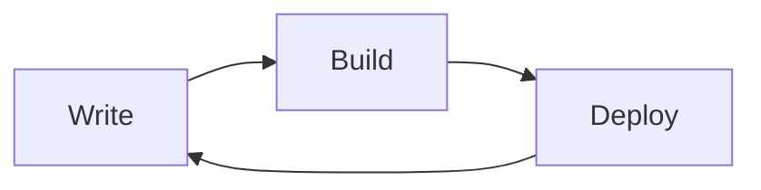

This post walks through every kind of content the template can render. Keep it
around as a reference, or delete it once you have your own posts.

## Math

Inline math like $E = mc^2$, and display math:

$$
\int_{-\infty}^{\infty} e^{-x^2}\,dx = \sqrt{\pi}
$$

Math is rendered by KaTeX, both inline and in blocks.

## Code highlighting

Code blocks follow the site theme automatically, with no configuration:

```r
library(tidyverse)

df <- read_csv("data.csv") |>
  filter(!is.na(value)) |>
  summarise(mean = mean(value), sd = sd(value))

print(df)
```

```python
from dataclasses import dataclass


@dataclass
class Point:
    x: float
    y: float

    def norm(self) -> float:
        return (self.x**2 + self.y**2) ** 0.5
```

```javascript
const posts = await getAllPostsWithBody();

export default function Home() {
  return posts.filter((post) => post.draft !== true);
}
```

## Tables

| Feature | Supported | Notes |
|---|---|---|
| Math | Yes | KaTeX, inline and block |
| Code highlighting | Yes | Shiki, dual theme |
| Diagrams | Yes | Mermaid |
| Image lightbox | Yes | Click to zoom, swipe between images |

## Footnotes and strikethrough

Here is a footnote[^1], and this sentence has ~~deleted text~~ in it.

[^1]: Footnotes render at the end of the post.

## Diagrams



Mermaid renders on the client in the browser, and is replaced with an image in
RSS readers, so it works in both places.

## Images

A single image takes its own line, rounded and centered:


Consecutive images are grouped, and the lightbox lets you swipe between them:


## Task lists

- [x] A finished task
- [ ] An unfinished task

## Quotes

> Block quotes use the secondary accent, so they stand apart from body text.

## Heading levels

### H3

#### H4

##### H5

###### H6

The table of contents on the right lists H2 through H6 — try clicking any of
them.
