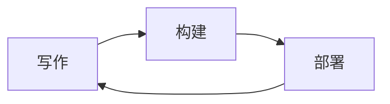

这篇文章把模板支持的每一种排版都走一遍。你可以把它当成一个可以随时回查的例子，也可以直接删掉。

## 公式

行内公式 $E = mc^2$，以及块级公式：

$$
\int_{-\infty}^{\infty} e^{-x^2}\,dx = \sqrt{\pi}
$$

公式由 KaTeX 渲染，行内与块级都支持。

## 代码高亮

代码块跟随站点主题自动切换配色，无需额外配置：

```r
library(tidyverse)

df <- read_csv("data.csv") |>
  filter(!is.na(value)) |>
  summarise(mean = mean(value), sd = sd(value))

print(df)
```

```python
from dataclasses import dataclass


@dataclass
class Point:
    x: float
    y: float

    def norm(self) -> float:
        return (self.x**2 + self.y**2) ** 0.5
```

```javascript
const posts = await getAllPostsWithBody();

export default function Home() {
  return posts.filter((post) => post.draft !== true);
}
```

## 表格

| 功能 | 支持 | 备注 |
|---|---|---|
| 公式 | 是 | KaTeX，行内与块级 |
| 代码高亮 | 是 | Shiki，双主题 |
| 图表 | 是 | Mermaid |
| 图片灯箱 | 是 | 点击放大，支持左右滑动 |

## 脚注与删除线

这是一个脚注[^1]，这是一段~~被删除的文字~~。

[^1]: 脚注内容会渲染在文末。

## 图表



Mermaid 在网页上由客户端渲染，在 RSS 阅读器里会被替换成图片，两种环境都能看到。

## 图片

单图会独占一行，并带有圆角与居中：


连着的多张图会被归为一组，灯箱里可以左右滑动切换：


## 任务列表

- [x] 已完成的任务
- [ ] 未完成的任务

## 引用

> 引用块使用次要强调色，与正文区分。

## 标题层级

### H3

#### H4

##### H5

###### H6

右侧目录会列出 H2 到 H6，可以试试点击其中任意一条。
